# B?O C?O ?? ?N M?N H?C - ?? T?I CNJ56
## X?Y D?NG ?NG D?NG DESKTOP QU?N L? TH?I KH?A BI?U V? T?I NGUY?N PH?NG H?C

> **Nh?m sinh vi?n th?c hi?n:** Nh?m 11 (2 th?nh vi?n)  
> **M? ?? t?i:** CNJ56  
> **H?c ph?n:** C?ng ngh? Java  
> **L?p t?n ch?:** C?NG NGH? JAVA-1-1-26(N05.THTT_IN_ELN.11)  
> **Gi?ng vi?n h??ng d?n:** ThS. Tr?n Nguy?n Ho?ng  
> **C?ng ngh?:** Java SE (Swing, Flat UI) + JDBC (Driver 8.3.0) + MySQL 8.0 (Localhost XAMPP)

---

TR??NG ??I H?C C?NG NGH? ??NG ?  
KHOA C?NG NGH? TH?NG TIN  
**B?I T?P L?N H?C PH?N C?NG NGH? JAVA**  
**CH? ?? 6: QU?N L? ??O T?O**  
**?? T?I CNJ56: X?Y D?NG ?NG D?NG DESKTOP QU?N L? TH?I KH?A BI?U V? T?I NGUY?N PH?NG H?C S? D?NG JAVA SWING, JDBC V? MYSQL**  

B?c Ninh ? 2026  

---

# DANH M?C H?NH ?NH

- **H?nh 2.1:** Bi?u ?? ph?n c?p ch?c n?ng h? th?ng (BFD) [Thi?t k? tr?n Draw.io]
- **Hình 2.2:** Sơ đồ kiến trúc hệ thống phân tầng tích hợp Tác nhân người dùng và Audit Log [Thiết kế trên Draw.io]
- **H?nh 2.3:** M? h?nh li?n k?t th?c th? (ERD)
- **H?nh 2.4:** M? h?nh v?t l? c? s? d? li?u (Physical Data Model)
- **H?nh 3.1:** Giao di?n ??ng nh?p h? th?ng & Quick Login 6 vai tr? (LoginForm)
- **H?nh 3.2:** Giao di?n Trang ch? t?ng quan Dashboard 6 th? KPI (DashboardPanel)
- **H?nh 3.3:** Giao di?n L??i Th?i Kh?a Bi?u Ma tr?n ?a chi?u (TimetableGridPanel - Matrix View)
- **H?nh 3.4:** Giao di?n L??i Th?i Kh?a Bi?u d?ng Kh?i tr?c quan (TimetableGridPanel - Block View)
- **H?nh 3.5:** Giao di?n Th?i Kh?a Bi?u Gi?ng d?y c? nh?n c?a Gi?ng vi?n
- **H?nh 3.6:** Giao di?n Qu?n l? Danh s?ch Th?i Kh?a Bi?u & Ph?n trang (ThoiKhoaBieuPanel)
- **H?nh 3.7:** H?p tho?i X?p l?ch m?i & C?nh b?o ph?t hi?n Xung ??t (XepLichDialog)
- **H?nh 3.8:** Giao di?n Gi?ng vi?n ?? xu?t ??i l?ch d?y v? Theo d?i ??n (DeXuatDoiLichPanel)
- **H?nh 3.9:** Giao di?n Ph? duy?t ??i l?ch 2 c?p ?? (DoiLichPanel)
- **H?nh 3.10:** Giao di?n Qu?n l? Ph?ng h?c & T?i nguy?n (PhongHocPanel)
- **H?nh 3.11:** Giao di?n Qu?n l? Gi?ng vi?n (GiangVienPanel)
- **H?nh 3.12:** Giao di?n Qu?n l? M?n h?c chu?n khung CT?T (MonHocPanel)
- **H?nh 3.13:** Giao di?n Qu?n l? L?p h?c sinh vi?n (LopHocPanel)
- **H?nh 3.14:** Giao di?n Qu?n l? Sinh vi?n t?ch h?p Thanh Ph?n trang (SinhVienPanel)
- **H?nh 3.15:** Giao di?n Qu?n l? Khung Ch??ng tr?nh ??o t?o 130 t?n ch? 4 n?m (CurriculumPanel)
- **H?nh 3.16:** Giao di?n Nh?t k? Ki?m to?n Ho?t ??ng & B?o m?t H? th?ng (AuditLogPanel)
- **H?nh 3.17:** Giao di?n Th?ng k? Gi? d?y & T?i ??o t?o Gi?ng vi?n (ThongKePanel - Gi?ng vi?n)
- **H?nh 3.18:** Giao di?n Th?ng k? Ph?n b? Sinh vi?n theo Ni?n kh?a & L?p h?c (ThongKePanel - Sinh vi?n)
- **H?nh 3.19:** Giao di?n Qu?n tr? T?i kho?n ng??i d?ng & Ph?n quy?n 6 vai tr? RBAC (TaiKhoanPanel)

---

# DANH M?C B?NG BI?U

- **B?ng 1.1:** Danh s?ch sinh vi?n th?c hi?n ?? t?i (Nh?m 11)
- **B?ng 1.2:** Ma tr?n ti?n ?? ph?i h?p tri?n khai 10 tu?n
- **B?ng 1.3:** B?ng ph?n c?ng nhi?m v? th?c hi?n ?? t?i (Nguy?n M?nh Quy?t 50% - H? Th?i B?o 50%)
- **B?ng 2.1:** B?ng ma tr?n ph?n quy?n 6 vai tr? ng??i d?ng (RBAC Matrix)
- **B?ng 2.2:** M? t? chi ti?t c?c m?n h?nh ch?nh trong h? th?ng
- **B?ng 2.3:** B?ng c?u tr?c c?c b?ng d? li?u trong C? s? d? li?u MySQL (quanly_tkb_cnj56)
- **B?ng 2.4:** B?ng m? t? chi ti?t vai tr? t?ng file m? ngu?n trong d? ?n
- **B?ng 3.1:** B?ng k?ch b?n v? k?t qu? ki?m th? h? th?ng (Test Cases Result)

---

# L?I M? ??U

Trong b?i c?nh hi?n ??i h?a v? chuy?n ??i s? gi?o d?c hi?n nay, c?ng t?c qu?n l? ??o t?o v? s?p x?p th?i kh?a bi?u t?i c?c tr??ng ??i h?c ??ng vai tr? then ch?t quy?t ??nh hi?u qu? v?n h?nh c?a to?n b? nh? tr??ng. Vi?c x?p l?ch th? c?ng tr?n gi?y t? ho?c qua b?ng t?nh Excel r?i r?c th??ng b?c l? r?t nhi?u h?n ch?: d? x?y ra xung ??t l?ch d?y c?a gi?ng vi?n, tr?ng ph?ng h?c, ph?n b? ph?ng kh?ng t??ng th?ch v?i s? s? l?p ho?c ??c th? m?n h?c (l? thuy?t/th?c h?nh), g?y l?ng ph? t?i nguy?n c? s? v?t ch?t v? m?t nhi?u th?i gian r? so?t, ?i?u ch?nh.

Xu?t ph?t t? nhu c?u th?c ti?n ??, nh?m sinh vi?n ?? l?a ch?n v? th?c hi?n ?? t?i m? s? **CNJ56: "X?y d?ng ?ng d?ng desktop qu?n l? th?i kh?a bi?u v? t?i nguy?n ph?ng h?c"**. ?ng d?ng ???c x?y d?ng tr?n n?n t?ng **Java Swing (NetBeans IDE)**, k?t n?i c? s? d? li?u quan h? **MySQL** th?ng qua JDBC, t?ch h?p thu?t to?n ki?m tra xung ??t th?i kh?a bi?u ?a chi?u th?i gian th?c, giao di?n tr?c quan h?a d?ng l??i tu?n ma tr?n & kh?i, quy tr?nh ??i l?ch 2 c?p ??, qu?n l? khung ch??ng tr?nh ??o t?o 130 t?n ch? 4 n?m v? h? th?ng nh?t k? ki?m to?n b?o m?t (Audit Log).

B?o c?o n?y tr?nh b?y to?n di?n qu? tr?nh nghi?n c?u, ph?n t?ch nghi?p v?, thi?t k? ki?n tr?c h? th?ng, thi?t k? c? s? d? li?u chu?n 3NF, c?i ??t m? ngu?n v? quy tr?nh ki?m th? nghi?m ng?t c?a ?? t?i.

---

# CH??NG 1. C? S? L? THUY?T

## 1.1. Gi?i thi?u v? ?? t?i

### 1.1.1. Gi?i thi?u t?ng quan
?ng d?ng desktop Qu?n l? th?i kh?a bi?u v? t?i nguy?n ph?ng h?c (CNJ56) l? gi?i ph?p to?n di?n h? tr? Ban Gi?m Hi?u, ph?ng ??o t?o, Tr??ng Khoa, Gi?ng vi?n v? Sinh vi?n:
- **Qu?n l? t?i nguy?n c? s? v?t ch?t:** Danh m?c ph?ng h?c, lo?i ph?ng (L? thuy?t, Th?c h?nh m?y t?nh, H?i tr??ng), t?a nh?, s?c ch?a, trang thi?t b? v? tr?ng th?i ho?t ??ng (?ang s? d?ng / B?o tr?).
- **Qu?n l? danh m?c ??o t?o ??i h?c:** 500+ Gi?ng vi?n, 50+ L?p sinh vi?n, 42 M?n h?c chu?n khung CT?T 130 t?n ch?, 2.000 Sinh vi?n 4 kh?a (K21 - K25).
- **L?p l?ch gi?ng d?y & Thu?t to?n ki?m tra xung ??t 6 chi?u th?i gian th?c:** Ng?n ch?n tuy?t ??i tr?ng ph?ng, tr?ng gi?ng vi?n, tr?ng l?ch l?p, sai lo?i ph?ng th?c h?nh, ph?ng ?ang b?o tr? v? c?nh b?o v??t s?c ch?a.
- **Tr?c quan h?a Th?i kh?a bi?u ?a chi?u:** L??i TKB Ma tr?n 12 ti?t x 7 ng?y, L??i TKB d?ng Kh?i (Block View), TKB gi?ng d?y c? nh?n c?a gi?ng vi?n, TKB theo l?p sinh vi?n.
- **Quy tr?nh ??i l?ch h?c 2 c?p ??:** Gi?ng vi?n g?i ?? xu?t -> Tr??ng Khoa duy?t chuy?n m?n c?p 1 -> Ph?ng ??o t?o duy?t ch?t c?p 2 v? t? ??ng ho?n ??i l?ch.
- **Nh?t k? Ki?m to?n An ninh (Audit Log):** Gi?m s?t 100% thao t?c nh?y c?m k?m IP, MAC, th?i gian, ng??i th?c hi?n v? d? li?u c? -> m?i ch?ng ch?i b?.
- **B?o c?o & Th?ng k? KPI:** Dashboard 6 th? KPI, th?ng k? gi? d?y c?a gi?ng vi?n, th?ng k? ph?n b? sinh vi?n theo ni?n kh?a/l?p h?c, xu?t b?o c?o CSV/Excel UTF-8 BOM.

### 1.1.2. Th?nh vi?n nh?m & Ph?n c?ng c?ng vi?c (Nh?m 2 th?nh vi?n)

**B?ng 1.1: Danh s?ch sinh vi?n th?c hi?n ?? t?i (Nh?m 11)**

| TT | M? sinh vi?n | Sinh vi?n th?c hi?n | L?p h?nh ch?nh | Vai tr? ??m nhi?m | T? l? ??ng g?p |
|:---:|:---:|:---|:---:|:---|:---:|
| 1 | 20231053 | **Nguy?n M?nh Quy?t** | DCCNTT.14.3 | Tr??ng nh?m & Backend Developer / KTS H? th?ng | 50% |
| 2 | 20231045 | **H? Th?i B?o** | DCCNTT.14.3 | Th?nh vi?n & Frontend Developer / QA Tester | 50% |

**B?ng 1.2: Ma tr?n ti?n ?? ph?i h?p tri?n khai 10 tu?n**

| Giai ?o?n | N?i dung c?ng vi?c | Th?i gian | S?n ph?m ??u ra | Ph? tr?ch ch?nh |
|:---|:---|:---:|:---|:---:|
| **Giai ?o?n 1** | Kh?o s?t b?i to?n, thu th?p y?u c?u nghi?p v?, ph?n r? ch?c n?ng BFD | Tu?n 1 - 2 | ??c t? y?u c?u SRS, s? ?? Draw.io BFD | C? 2 th?nh vi?n |
| **Giai ?o?n 2** | Thi?t k? CSDL 3NF, ERD, ki?n tr?c ph?n t?ng Draw.io | Tu?n 3 - 4 | database.sql (11 b?ng), s? ?? ki?n tr?c | Nguy?n M?nh Quy?t |
| **Giai ?o?n 3** | X?y d?ng t?ng Model, DBConnection Pool, c?c l?p DAO, Util | Tu?n 5 - 6 | Source code model, dao, connection, util | Nguy?n M?nh Quy?t |
| **Giai ?o?n 4** | X?y d?ng Service (xung ??t 6 chi?u, workflow ??i l?ch) & Giao di?n Flat UI | Tu?n 7 - 8 | Source code service, view (Panels, Dialogs) | C? 2 th?nh vi?n |
| **Giai ?o?n 5** | T?ch h?p Audit Log, ph?n trang PaginationBar, CT?T 130 t?n ch? | Tu?n 9 | Source code ho?n ch?nh, Dashboard 6 cards | H? Th?i B?o |
| **Giai ?o?n 6** | Ki?m th? Unit Test 15 Test Cases, ho?n thi?n b?o c?o v? README | Tu?n 10 | B?o c?o ?? ?n docx/md, GitHub repository | C? 2 th?nh vi?n |

**B?ng 1.3: B?ng ph?n c?ng nhi?m v? th?c hi?n ?? t?i chi ti?t**

| STT | H? v? t?n | Vai tr? | Nhi?m v? ch?nh chi ti?t | T? l? |
|:---:|:---|:---:|:---|:---:|
| **1** | **Nguy?n M?nh Quy?t** *(Tr??ng nh?m)* | Tr??ng nh?m & Backend Developer | ? Ph?n r? ch?c n?ng BFD, thi?t k? CSDL chu?n 3NF (11 b?ng), vi?t k?ch b?n `database.sql`.<br>? Thi?t k? s? ?? ki?n tr?c ph?n t?ng tr?n Draw.io (`kientruc_hethong_phantang.drawio`).<br>? X?y d?ng t?ng k?t n?i `DBConnection` Singleton v? to?n b? c?c l?p DAO (`ThoiKhoaBieuDAO`, `PhongHocDAO`, `GiangVienDAO`, `SinhVienDAO`, `ChuongTrinhDaoTaoDAO`, `YeuCauDoiLichDAO`, `AuditLogDAO`).<br>? C?i ??t thu?t to?n ki?m tra xung ??t TKB ?a chi?u 6 r?ng bu?c (`XepLichService`).<br>? X?y d?ng c? ch? x?c th?c SHA-256 v? ma tr?n ph?n quy?n 6 vai tr? RBAC (`AuthService`).<br>? X?y d?ng b? ?i?u khi?n WebServer API v? k?ch b?n Unit Test (`TestLogicRunner.java`). | **50%** |
| **2** | **H? Th?i B?o** *(Th?nh vi?n)* | Th?nh vi?n & Frontend / QA | ? Thi?t k? giao di?n Java Swing Flat UI chu?n hi?n ??i (`MainForm`, `LoginForm` Quick Login).<br>? X?y d?ng L??i Th?i kh?a bi?u ?a chi?u (`TimetableGridPanel`: Matrix View & Block View, Zoom/Scroll).<br>? X?y d?ng c?c Panel danh m?c: `SinhVienPanel`, `CurriculumPanel` (130 t?n ch?), `DeXuatDoiLichPanel`, `DoiLichPanel`, `AuditLogPanel`, `ThongKePanel`.<br>? X?y d?ng component thanh ph?n trang `PaginationBar` d?ng chung cho to?n h? th?ng.<br>? C?i ??t `WorkflowService` (quy tr?nh duy?t 2 c?p), `ThongKeService` v? `ExportUtil` (Excel UTF-8 BOM).<br>? Th?c hi?n ki?m th? bi?n, ki?m th? giao di?n v? ho?n thi?n t?i li?u thuy?t minh ?? ?n. | **50%** |

---

## 1.2. Gi?i thu?t & C?ng ngh? s? d?ng

### 1.2.1. Thu?t to?n ki?m tra xung ??t th?i kh?a bi?u ?a chi?u
Thu?t to?n ???c tri?n khai trong `XepLichService`, gi?i quy?t b?i to?n giao thoa ?a chi?u gi?a c?c ??i l??ng:
- **Th?i gian:** H?c k?, N?m h?c, Tu?n h?c $[T_{start}, T_{end}]$, Th? trong tu?n, Ti?t h?c $[S_{start}, S_{end}]$.
- **Kh?ng gian t?i nguy?n:** Ph?ng h?c, Lo?i ph?ng, S?c ch?a ch? ng?i.
- **Con ng??i:** Gi?ng vi?n gi?ng d?y, L?p sinh vi?n tham gia.

?i?u ki?n giao nhau v? kho?ng th?i gian gi?a hai l?ch $A$ v? $B$:
$$\begin{cases}
A.\text{hoc\_ky} = B.\text{hoc\_ky} \land A.\text{nam\_hoc} = B.\text{nam\_hoc} \\
A.\text{thu\_trong\_tuan} = B.\text{thu\_trong\_tuan} \\
A.\text{tuan\_bat\_dau} \le B.\text{tuan\_ket\_thuc} \land A.\text{tuan\_ket\_thuc} \ge B.\text{tuan\_bat\_dau} \\
A.\text{tiet\_bat\_dau} \le B.\text{tiet\_ket\_thuc} \land A.\text{tiet\_ket\_thuc} \ge B.\text{tiet\_bat\_dau}
\end{cases}$$

C?c ?i?u ki?n ki?m tra vi ph?m theo th? t? ?u ti?n:
1. **Tr?ng ph?ng h?c:** Hai l?p c?ng h?c m?t ph?ng v?o c?ng th?i ?i?m -> B?o l?i xung ??t ph?ng.
2. **Tr?ng gi?ng vi?n:** Gi?ng vi?n ?ang d?y l?p kh?c v?o c?ng khung gi? -> B?o l?i xung ??t gi?ng vi?n.
3. **Tr?ng l?p h?c:** L?p sinh vi?n ?ang c? l?ch h?c m?n kh?c -> B?o l?i xung ??t l?p.
4. **Tr?ng th?i ph?ng kh?ng s?n s?ng:** Ph?ng ?ang trong tr?ng th?i `BAO_TRI` ho?c `NGUNG_SU_DUNG` -> T? ch?i x?p l?ch.
5. **Kh?ng t??ng th?ch lo?i ph?ng:** M?n h?c th?c h?nh (`THUC_HANH`) nh?ng x?p v?o ph?ng l? thuy?t th??ng -> T? ch?i x?p l?ch ?? ??m b?o trang thi?t b? m?y t?nh.
6. **V??t qu? s?c ch?a ph?ng:** S? s? l?p > S?c ch?a t?i ?a c?a ph?ng -> ??a ra c?nh b?o tr?c ti?p cho ng??i x?p l?ch.

---

# CH??NG 2. THI?T K? V? X?Y D?NG H? TH?NG

## 2.1. Ph?n t?ch y?u c?u b?i to?n

### 2.1.1. T?c nh?n h? th?ng & Ma tr?n Ph?n quy?n RBAC (6 Vai tr?)
H? th?ng Qu?n l? Th?i kh?a bi?u v? T?i nguy?n Ph?ng h?c (CNJ56) ???c thi?t k? ph?c v? 6 nh?m t?c nh?n ch?nh:
1. **Qu?n tr? vi?n (`ADMIN`):** Qu?n l? to?n di?n t?i kho?n ng??i d?ng, c?p ph?t v? thay ??i vai tr?, ??t l?i m?t kh?u, gi?m s?t to?n b? Nh?t k? ki?m to?n an ninh (`AuditLog`).
2. **Ban Gi?m Hi?u (`BAN_GIAM_HIEU`):** Gi?m s?t Dashboard t?ng quan to?n tr??ng, xem ti?n ?? ??o t?o, xem TKB t?t c? c?c khoa/l?p, ph? duy?t c?p 2 c?c ??n xin ??i l?ch d?y c?a gi?ng vi?n.
3. **C?n b? Ph?ng ??o T?o (`PHONG_DAO_TAO`):** L?p l?ch th?i kh?a bi?u, ?i?u ph?i ph?ng h?c v? thi?t b?, x? l? xung ??t l?ch h?c, ph? duy?t ??i l?ch c?p 2 v? xu?t b?o c?o.
4. **Tr??ng Khoa / B? M?n (`TRUONG_KHOA`):** Qu?n l? h? s? gi?ng vi?n, danh m?c m?n h?c thu?c khoa, th?m ??nh v? ph? duy?t s? b? (c?p 1) c?c ??n ?? xu?t ??i l?ch d?y c?a gi?ng vi?n trong khoa.
5. **Gi?ng Vi?n (`GIANG_VIEN`):** Tra c?u th?i kh?a bi?u gi?ng d?y c? nh?n trong t?ng tu?n/h?c k?, t?o phi?u ?? xu?t xin ??i ca d?y khi c? vi?c ??t xu?t v? theo d?i ti?n ?? duy?t.
6. **Sinh Vi?n (`SINH_VIEN`):** Tra c?u th?i kh?a bi?u l?p h?c theo tu?n, xem khung ch??ng tr?nh ??o t?o chu?n 130 t?n ch? 4 n?m v? ti?n ?? h?c t?p c? nh?n.

**B?ng 2.1: Ma tr?n ph?n quy?n 6 vai tr? ng??i d?ng (RBAC Matrix)**

| Ph?n h? / Ch?c n?ng | ADMIN | BAN_GIAM_HIEU | PHONG_DAO_TAO | TRUONG_KHOA | GIANG_VIEN | SINH_VIEN |
|:---|:---:|:---:|:---:|:---:|:---:|:---:|
| **Dashboard KPI & Th?ng k? t?ng quan** | Full | Full | Full | View | View | View |
| **L??i TKB Tu?n (Matrix & Block)** | View | View | Full | View | View (C? nh?n) | View (L?p) |
| **X?p l?ch TKB (Th?m / S?a / X?a)** | Kh?a | View | **Full** | View | Kh?a | Kh?a |
| **?? xu?t ??i l?ch d?y** | Kh?a | Kh?a | Kh?a | Kh?a | **T?o ??n** | Kh?a |
| **Ph? duy?t ??i l?ch d?y** | Kh?a | **Duy?t C?p 2** | **Duy?t C?p 2** | **Duy?t C?p 1** | Kh?a | Kh?a |
| **Qu?n l? Ph?ng h?c & Thi?t b?** | Full | View | Full | View | View | View |
| **Qu?n l? Gi?ng vi?n & M?n h?c** | Full | View | Full | Full | View | View |
| **Khung CT?T 130 T?n Ch?** | Full | View | Full | Full | View | View |
| **Qu?n l? Sinh vi?n & Ph?n trang** | Full | View | Full | Full | View | View (C? nh?n) |
| **Nh?t k? Ki?m to?n (Audit Log)** | **Full** | View | Kh?a | Kh?a | Kh?a | Kh?a |
| **Qu?n tr? T?i kho?n & Ph?n quy?n** | **Full** | Kh?a | Kh?a | Kh?a | Kh?a | Kh?a |

---

### 2.1.2. Bi?u ?? ph?n c?p ch?c n?ng h? th?ng (BFD)
Bi?u ?? ph?n c?p ch?c n?ng (Business Function Diagram - BFD) ???c thi?t k? chi ti?t b?ng c?ng c? **Draw.io** (`docs/architecture/bieudo_phancap_chucnang.drawio`) nh?m m? h?nh h?a to?n di?n c?y ph?n c?p nghi?p v? c?a ?? t?i CNJ56. H? th?ng ???c ph?t tri?n t? n?t g?c trung t?m 'H? TH?NG QU?N L? TH?I KH?A BI?U V? T?I NGUY?N PH?NG H?C' v? ph?n r? ??i x?ng th?nh 7 ph?n h? ch?nh v?i 38 ch?c n?ng chi ti?t:
1. **Tr?c ph?n nh?nh h??ng l?n (3 ph?n h? nghi?p v? & qu?n tr?):**
   - **B?o c?o v? th?ng k?:** Th?ng k? t?i gi?ng d?y (ti?t/tu?n), t? l? l?p ??y ph?ng, qu?t ph?ng tr?ng th?i gian th?c, xu?t file CSV/Excel UTF-8 BOM.
   - **X?p l?ch v? th?i kh?a bi?u:** L?p l?ch m?i, l?c TKB ?a chi?u, tr?c quan h?a L??i TKB tu?n c? Zoom chu?t, ph?n b? ph?ng theo lo?i (LT/TH), ki?m tra xung ??t 6 chi?u theo th?i gian th?c, ng?n ch?n tr?ng ph?ng/GV/l?p, ch?nh s?a v? h?y ca h?c.
   - **Ti?n ?ch h? t?ng & Ki?m to?n:** K?t n?i DBConnection Pool, n?p seed data m?u, m? h?a SHA-256, ghi v?t ki?m to?n Audit Log t? ??ng, c? ch? ch?ng ch?i b? tr?ch nhi?m v? ki?m ??nh d? li?u ??u v?o.
2. **Tr?c ph?n nh?nh h??ng xu?ng (4 ph?n h? qu?n tr? danh m?c & ph? duy?t):**
   - **Qu?n l? t?i kho?n ng??i d?ng:** ??ng nh?p/x?c th?c, t?o t?i kho?n, s?a th?ng tin, kh?a/x?a t?i kho?n, ph?n quy?n RBAC 6 vai tr?.
   - **Qu?n l? ph?ng h?c & thi?t b?:** Th?m ph?ng m?i, s?a s?c ch?a, x?a ph?ng, thi?t l?p tr?ng th?i b?o tr?, ph?n lo?i ph?ng LT / Th?c h?nh PM.
   - **Qu?n l? danh m?c ??o t?o:** Qu?n l? 500 gi?ng vi?n, 42 m?n h?c (130 t?n ch? chu?n), 50 l?p h?c v? 2.000 sinh vi?n, khung CT?T 4 n?m.
   - **?? xu?t v? duy?t ??i l?ch:** Gi?ng vi?n g?i ??n ??i ca, ki?m tra xung ??t ca m?i, Khoa duy?t s? b?, Ph?ng ??o t?o duy?t ch?t, t? ??ng ho?n ??i TKB.


*H?nh 2.1: Bi?u ?? ph?n c?p ch?c n?ng h? th?ng (BFD) [Thi?t k? tr?n Draw.io]*

---

## 2.2. Ki?n tr?c h? th?ng ph?n t?ng (Layered Architecture)
H? th?ng ???c thi?t k? theo m? h?nh **Ki?n tr?c Ph?n t?ng (Layered Architecture)** chu?n c?ng nghi?p k?t h?p t?ng ?i?u h??ng (Controller Layer) v? Tr?c An ninh - B? tr? (Cross-Cutting Concerns) ch?y d?c to?n b? h? th?ng. (S? ?? ???c thi?t k? chi ti?t b?ng c?ng c? Draw.io t?i `docs/architecture/kientruc_hethong_phantang.drawio`).


*Hình 2.2: Sơ đồ kiến trúc hệ thống phân tầng tích hợp Tác nhân người dùng và Audit Log [Thiết kế trên Draw.io]*

### 2.2.1. Ph?n t?ch chi ti?t c?c t?ng ki?n tr?c:
0. **Tầng Tác nhân người dùng (Actors / Roles - 6 vai trò RBAC):** Điểm khởi đầu của mọi tương tác người dùng vào hệ thống bao gồm: Quản Trị Viên (Admin), Ban Giám Hiệu, Phòng Đào Tạo, Trưởng Khoa / Bộ Môn, Giảng Viên, Sinh Viên với các quyền hạn và phạm vi giao diện được phân lập nghiêm ngặt.
1. **T?ng Tr?nh di?n (Presentation Layer - Java Swing & Flat UI):** Ch?u tr?ch nhi?m t??ng t?c ng??i d?ng: `LoginForm`, `MainForm` (?i?u ph?i qua CardLayout), `TimetableGridPanel` (ma tr?n 12 ti?t x 7 ng?y, Zoom in/out, Block View), `ThoiKhoaBieuPanel`, `DeXuatDoiLichPanel`, `DoiLichPanel`, `CurriculumPanel`, `SinhVienPanel`, `AuditLogPanel`, `ThongKePanel`, `TaiKhoanPanel`, `PaginationBar`.
2. **T?ng ?i?u h??ng & Ti?p nh?n (Controller Layer):** C?u n?i trung gian ti?p nh?n s? ki?n t? View, tr?ch xu?t form, ki?m tra h?p l? s? b? v? ?y quy?n x? l? cho Service: `AuthController`, `TimetableController`, `CurriculumController`, `RescheduleController`, `AuditController`, `UserController`, `WebServer` (REST API).
3. **T?ng Nghi?p v? (Service Layer):** H?t nh?n x? l? logic v? thu?t to?n:
   - `AuthService`: X?c th?c ??ng nh?p b?m SHA-256 v? ph?n quy?n RBAC 6 vai tr?.
   - `XepLichService`: Engine ki?m tra xung ??t l?ch h?c 6 chi?u theo th?i gian th?c.
   - `WorkflowService`: X? l? quy tr?nh ph? duy?t ??i l?ch 2 c?p nghi?m ng?t (Khoa -> ??o t?o).
   - `AuditService`: D?ch v? ghi v?t ki?m to?n ch?ng ch?i b? (Non-repudiation).
   - `ThongKeService`: ?o l??ng hi?u su?t ph?ng, t?i gi?ng d?y c?a GV v? ph?n b? sinh vi?n.
4. **T?ng Truy c?p D? li?u (DAO Layer - JDBC PreparedStatement):** Th?c thi CRUD qua 100% PreparedStatement: `ThoiKhoaBieuDAO`, `PhongHocDAO`, `GiangVienDAO`, `SinhVienDAO`, `ChuongTrinhDaoTaoDAO`, `YeuCauDoiLichDAO`, `AuditLogDAO`, `TaiKhoanDAO`.
5. **T?ng Th?c th? (Model Layer):** ?nh x? ??i t??ng POJO: `TaiKhoan`, `PhongHoc`, `GiangVien`, `MonHoc`, `LopHoc`, `SinhVien`, `ChuongTrinhDaoTao`, `ThoiKhoaBieu`, `YeuCauDoiLich`, `LichSuDuyet`, `AuditLog`.
6. **C? s? d? li?u quan h? (Database Tier - MySQL 8.0 Localhost):** Chu?n 3NF `quanly_tkb_cnj56` ch?y tr?n MySQL (XAMPP c?ng 3306), k?t n?i qua MySQL Connector/J 8.3.0.
7. **Tr?c B? tr? & An ninh (Cross-Cutting Concerns):** Ch?y d?c xuy?n su?t c?c t?ng: `DBConnection` (Singleton connection pool), `PasswordUtil` (m? h?a SHA-256), `ExportUtil` (xu?t CSV/Excel UTF-8 BOM), `ValidationUtil`, `UIUtil` (FlatButton ?? h?a kh? r?ng c?a).

---

## 2.3. Thi?t k? giao di?n

**B?ng 2.2: M? t? chi ti?t c?c m?n h?nh ch?nh trong h? th?ng**

| STT | T?n m?n h?nh / Panel | File m? ngu?n | Ch?c n?ng nghi?p v? ch?nh |
|:---:|:---|:---|:---|
| 1 | **??ng nh?p h? th?ng** | `LoginForm.java` | Ti?p nh?n ??ng nh?p, x?c th?c SHA-256, t?ch h?p 6 n?t Quick Login ch?n nhanh vai tr? ki?m th?. |
| 2 | **Trang ch? Dashboard** | `DashboardPanel.java` | 6 th? KPI t?ng quan (Ph?ng, GV, SV, M?n, TKB tu?n, Ch? duy?t), bi?u ?? ph?n b? v? th?ng tin h? th?ng. |
| 3 | **L??i TKB ?a Chi?u** | `TimetableGridPanel.java` | Hi?n th? ma tr?n 12 ti?t x 7 ng?y, chuy?n ??i Matrix View / Block View, xem theo Ph?ng/GV/L?p, Zoom/Scroll. |
| 4 | **Qu?n l? Danh s?ch TKB** | `ThoiKhoaBieuPanel.java` | B?ng d? li?u TKB to?n tr??ng, b? l?c ?a ti?u ch?, n?t Th?m/S?a/X?a/Xu?t Excel v? ph?n trang. |
| 5 | **H?p tho?i X?p l?ch** | `XepLichDialog.java` | Form th?m/s?a ca h?c, t? ??ng k?ch ho?t `XepLichService` ki?m tra xung ??t th?i gian th?c 6 chi?u. |
| 6 | **?? xu?t ??i l?ch d?y** | `DeXuatDoiLichPanel.java` | Gi?ng vi?n ch?n ca c?n ??i, ch?n th?i gian/ph?ng m?i, nh?p l? do v? g?i ??n l?n c?p th?m quy?n. |
| 7 | **Ph? duy?t ??i l?ch 2 c?p**| `DoiLichPanel.java` | Tr??ng Khoa duy?t c?p 1 -> ??o t?o duy?t c?p 2; t? ??ng c?p nh?t ho?n ??i TKB khi ??n ???c ch?p thu?n. |
| 8 | **Khung CT?T 130 T?n Ch?** | `CurriculumPanel.java` | Qu?n l? 42 m?n h?c chu?n khung ??i h?c 4 n?m (8 h?c k?) cho c?c kh?a sinh vi?n K21, K22, K23, K24, K25. |
| 9 | **Qu?n l? Sinh vi?n** | `SinhVienPanel.java` | Qu?n l? 2.000 sinh vi?n, t?ch h?p thanh ph?n trang `PaginationBar` (20 SV/trang), t?m ki?m ?a n?ng. |
| 10 | **Nh?t k? Ki?m to?n** | `AuditLogPanel.java` | Gi?m s?t to?n b? ho?t ??ng nh?y c?m trong h? th?ng, ghi nh?n IP, MAC, th?i gian, d? li?u c? -> m?i. |
| 11 | **Th?ng k? & Tra c?u** | `ThongKePanel.java` | Th?ng k? t?i gi?ng d?y c?a GV, ph?n b? SV theo kh?a/l?p, c?ng su?t s? d?ng ph?ng h?c, qu?t ph?ng tr?ng. |
| 12 | **Qu?n l? T?i kho?n** | `TaiKhoanPanel.java` | D?nh ri?ng cho ADMIN: CRUD t?i kho?n, c?p ph?t 6 vai tr? RBAC, ??i m?t kh?u, b?t/t?t kh?a t?i kho?n. |

---

## 2.4. Thi?t k? c? s? d? li?u

C? s? d? li?u `quanly_tkb_cnj56` ???c chu?n h?a ??t d?ng chu?n **3NF**, bao g?m **11 b?ng d? li?u**:
1. `tai_khoan`: Qu?n l? ng??i d?ng, m?t kh?u b?m SHA-256 v? vai tr? RBAC (`ADMIN`, `BAN_GIAM_HIEU`, `PHONG_DAO_TAO`, `TRUONG_KHOA`, `GIANG_VIEN`, `SINH_VIEN`).
2. `phong_hoc`: Qu?n l? 20 ph?ng h?c (L? thuy?t, Th?c h?nh PM, H?i tr??ng), t?a nh?, s?c ch?a, tr?ng th?i b?o tr?.
3. `giang_vien`: Qu?n l? danh m?c 500+ gi?ng vi?n, khoa b? m?n, email, s? ?i?n tho?i.
4. `mon_hoc`: Qu?n l? danh m?c 42 m?n h?c chu?n khung CT?T 130 t?n ch? (L? thuy?t / Th?c h?nh).
5. `lop_hoc`: Qu?n l? danh m?c c?c l?p sinh vi?n ch?nh quy (s? s?, ni?n kh?a ??o t?o).
6. `thoi_khoa_bieu`: B?ng trung t?m l?u tr? l?ch h?c: li?n k?t m?n, l?p, gi?ng vi?n, ph?ng h?c, h?c k?, n?m h?c, th?, ti?t, tu?n.
7. `sinh_vien`: Qu?n l? 2.000 sinh vi?n thu?c c?c kh?a K21, K22, K23, K24, K25.
8. `chuong_trinh_dao_tao`: L?u tr? khung ch??ng tr?nh ??o t?o chu?n 4 n?m (8 h?c k?, 130 t?n ch?) theo t?ng kh?a sinh vi?n.
9. `yeu_cau_doi_lich`: Qu?n l? ??n ?? xu?t ??i l?ch d?y c?a gi?ng vi?n, c?p ph? duy?t (1 ho?c 2) v? tr?ng th?i duy?t.
10. `lich_su_phe_duyet`: L?u tr? bi?n b?n l?ch s? ph? duy?t c?a Tr??ng Khoa v? Ph?ng ??o t?o k?m ? ki?n th?m ??nh.
11. `audit_log`: L?u tr? d?u v?t ki?m to?n an ninh: ??a ch? IP, t?n ??ng nh?p, h?nh ??ng, ??i t??ng, d? li?u c? -> m?i, th?i gian.

---

## 2.5. T? ch?c d? ?n & M? t? file m? ngu?n

```
BTL/
??? docs/architecture/                 # S? ?? thi?t k? ki?n tr?c h? th?ng
?   ??? bieudo_phancap_chucnang.drawio # File m? ngu?n s? ?? BFD tr?n Draw.io
?   ??? kientruc_hethong_phantang.drawio# File m? ngu?n s? ?? ki?n tr?c tr?n Draw.io
??? docs/images/                       # ?nh xu?t b?n ch?t l??ng cao
??? screenshots/                       # ?nh ch?p th?c t? nghi?m thu ch?c n?ng
??? lib/mysql-connector-j-8.3.0.jar    # Driver JDBC MySQL 8.3.0
??? src/
?   ??? connection/DBConnection.java   # Qu?n l? k?t n?i JDBC Singleton Pool
?   ??? controller/                    # B? ?i?u khi?n trung gian & Web API
?   ?   ??? AuthController.java
?   ?   ??? TimetableController.java
?   ?   ??? CurriculumController.java
?   ?   ??? RescheduleController.java
?   ?   ??? AuditController.java
?   ?   ??? UserController.java
?   ?   ??? WebServer.java
?   ??? dao/                           # T?ng thao t?c CSDL JDBC PreparedStatement
?   ?   ??? TaiKhoanDAO.java
?   ?   ??? PhongHocDAO.java
?   ?   ??? GiangVienDAO.java
?   ?   ??? MonHocDAO.java
?   ?   ??? LopHocDAO.java
?   ?   ??? SinhVienDAO.java
?   ?   ??? ChuongTrinhDaoTaoDAO.java
?   ?   ??? ThoiKhoaBieuDAO.java
?   ?   ??? YeuCauDoiLichDAO.java
?   ?   ??? AuditLogDAO.java
?   ??? model/                         # Th?c th? POJO ?nh x? b?ng CSDL
?   ?   ??? TaiKhoan.java, PhongHoc.java, GiangVien.java, MonHoc.java, LopHoc.java
?   ?   ??? SinhVien.java, ChuongTrinhDaoTao.java, ThoiKhoaBieu.java
?   ?   ??? YeuCauDoiLich.java, LichSuDuyet.java, AuditLog.java
?   ??? service/                       # X? l? logic nghi?p v? c?t l?i
?   ?   ??? AuthService.java (X?c th?c & RBAC)
?   ?   ??? XepLichService.java (Engine ki?m tra xung ??t th?i gian th?c 6 chi?u)
?   ?   ??? WorkflowService.java (Quy tr?nh ph? duy?t ??i l?ch 2 c?p ??)
?   ?   ??? AuditService.java (Ghi v?t ki?m to?n an ninh)
?   ?   ??? ThongKeService.java (T?nh to?n c?ng su?t ph?ng, t?i GV, th?ng k? SV)
?   ??? util/                          # Ti?n ?ch b? tr? h? th?ng
?   ?   ??? PasswordUtil.java (B?m SHA-256)
?   ?   ??? ValidationUtil.java (Ki?m ??nh d? li?u ??u v?o)
?   ?   ??? ExportUtil.java (Xu?t CSV/Excel UTF-8 BOM)
?   ?   ??? UIUtil.java (FlatButton, v? kh? r?ng c?a, bo g?c)
?   ?   ??? DataSeeder.java (N?p b? d? li?u m?u 42 m?n, 2.000 SV, 500 GV)
?   ??? view/                          # Giao di?n ng??i d?ng Java Swing
?       ??? LoginForm.java, MainForm.java
?       ??? dialog/ (XepLichDialog, DoiLichDialog, TaiKhoanDialog, PhongHocDialog...)
?       ??? panel/ (DashboardPanel, TimetableGridPanel, ThoiKhoaBieuPanel, DeXuatDoiLichPanel,
?                   DoiLichPanel, CurriculumPanel, SinhVienPanel, AuditLogPanel,
?                   ThongKePanel, TaiKhoanPanel, PaginationBar...)
??? test/TestLogicRunner.java          # B? ki?m th? Unit Test t? ??ng
??? database.sql                       # K?ch b?n kh?i t?o CSDL & d? li?u m?u
??? README.md                          # H??ng d?n c?i ??t v? v?n h?nh
```

---

# CH??NG 3. PH?T TRI?N H? TH?NG V? KI?M TH?

## 3.1. T?ng Tr?nh di?n (Presentation Layer)
Giao di?n ???c x?y d?ng 100% b?ng Java Swing k?t h?p c?c th? vi?n chu?n JDK, s? d?ng c? ch? b? c?c `CardLayout` t?i `MainForm` ?? chuy?n ??i m??t m? gi?a c?c ph?n h? ch?c n?ng:
- **Thanh ?i?u h??ng Sidebar t? th?ch ?ng:** T? ??ng ?n c?c m?c menu kh?ng thu?c th?m quy?n c?a t?i kho?n ??ng nh?p theo ??ng ph?n quy?n RBAC.
- **Thanh ph?n trang PaginationBar:** T?i ?u h?a hi?u n?ng hi?n th? cho c?c b?ng d? li?u l?n (2.000 sinh vi?n, 500 gi?ng vi?n, h?ng tr?m l?ch h?c), ng?n ch?n ho?n to?n hi?n t??ng tr?n b? nh? JVM Heap.

---

## 3.2. T?ng Nghi?p v? (Service Layer)
- **Engine X?p L?ch & Ng?n Ng?a Xung ??t (`XepLichService`):** Thu?t to?n ??i so?t 6 chi?u ??c l?p ch?y tr??c m?i thao t?c l?u v?o CSDL, ??m b?o t?nh to?n v?n v? h?p l? cho to?n b? th?i kh?a bi?u c?a nh? tr??ng.
- **Quy tr?nh Ph? duy?t ??i l?ch 2 C?p (`WorkflowService`):** Ki?m so?t lu?ng ??n ch?t ch? t? Gi?ng vi?n -> Khoa -> ??o t?o. Ch? khi ??o t?o duy?t ch?t, h? th?ng m?i t? ??ng ho?n ??i v? c?p nh?t b?n ghi trong b?ng `thoi_khoa_bieu`.
- **D?ch v? Ki?m to?n B?o m?t (`AuditService`):** Ho?t ??ng song song v? ??c l?p, ghi nh?n d?u v?t m?i thao t?c nh?y c?m v?o b?ng `audit_log` ph?c v? thanh tra v? ch?ng ch?i b? tr?ch nhi?m.

---

## 3.3. T?ng Truy c?p D? li?u & Ti?n ?ch (DAO & Util)
- ?p d?ng 100% c?u l?nh `PreparedStatement` ch?ng tri?t ?? l? h?ng SQL Injection.
- S? d?ng m? h?nh k?t n?i Singleton Pool trong `DBConnection` gi?p t?i s? d?ng k?t n?i hi?u qu?, tr?nh c?n ki?t Connection Pool c?a MySQL.
- Xu?t b?o c?o qua `ExportUtil` t? ??ng ch?n k? t? **Byte Order Mark UTF-8 (`\uFEFF`)** ? ??u t?p, ??m b?o hi?n th? ho?n h?o font Ti?ng Vi?t c? d?u khi m? b?ng Microsoft Excel tr?n m?i phi?n b?n Windows.

---

## 3.4. K?t qu? ??t ???c (B? s?u t?p Giao di?n Th?c t?)

H? th?ng ?? ???c th? nghi?m v? nghi?m thu th?c t? th?nh c?ng tr?n m?i tr??ng **NetBeans IDE + XAMPP MySQL**. D??i ??y l? m? t? chi ti?t v? h?nh ?nh ch?p th?c t? t?ng ch?c n?ng:

### 1. M?n h?nh ??ng nh?p h? th?ng & Quick Login (LoginForm)
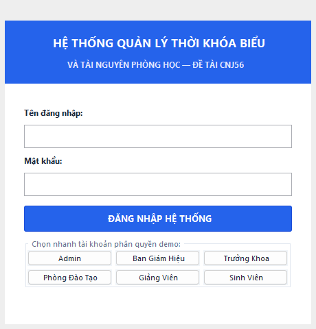
*H?nh 3.1: Giao di?n ??ng nh?p h? th?ng & Quick Login 6 vai tr? (LoginForm)*  
**M? t?:** Ti?p nh?n t?n ??ng nh?p v? m?t kh?u, x?c th?c b?ng m? h?a SHA-256. T?ch h?p s?n 6 n?t b?m ch?n nhanh vai tr? (Admin, Ban Gi?m Hi?u, Ph?ng ??o T?o, Tr??ng Khoa, Gi?ng Vi?n, Sinh Vi?n) gi?p h?i ??ng ch?m ?? ?n d? d?ng ki?m th? ph?n quy?n m? kh?ng c?n nh?p l?i m?t kh?u.

---

### 2. M?n h?nh Trang ch? Dashboard 6 th? KPI (DashboardPanel)
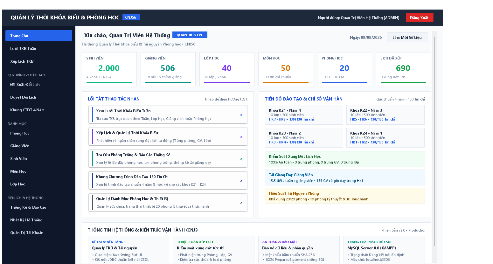
*H?nh 3.2: Giao di?n Trang ch? t?ng quan Dashboard 6 th? KPI (DashboardPanel)*  
**M? t?:** Hi?n th? 6 th? th?ng k? KPI t?ng quan: T?ng s? ph?ng h?c, Gi?ng vi?n, Sinh vi?n, M?n h?c, L?ch h?c tu?n hi?n t?i v? S? ??n ??i l?ch ch? x? l?. Kh?i th?ng tin h? th?ng ???c thi?t k? chuy?n nghi?p v? ??t g?n g?ng ? ph?a d??i theo ??ng y?u c?u nghi?p v?.

---

### 3. M?n h?nh L??i Th?i Kh?a Bi?u Ma tr?n ?a chi?u (TimetableGridPanel - Matrix View)
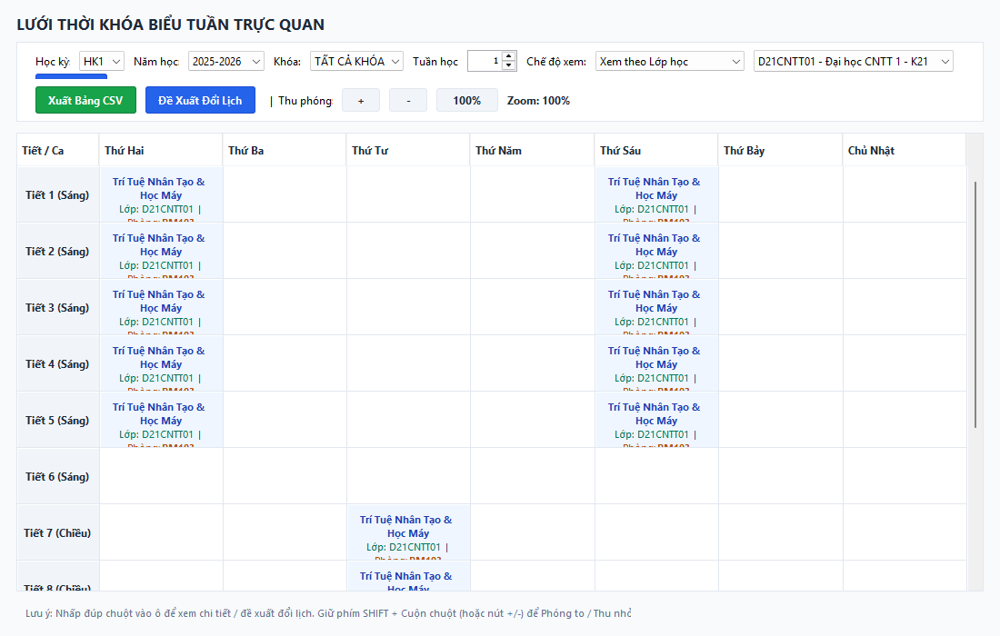
*H?nh 3.3: Giao di?n L??i Th?i Kh?a Bi?u Ma tr?n ?a chi?u (TimetableGridPanel - Matrix View)*  
**M? t?:** Tr?c quan h?a th?i kh?a bi?u theo ma tr?n 12 ti?t h?c $\times$ 7 ng?y trong tu?n. H? tr? l?c xem theo L?p, theo Ph?ng h?c, theo Gi?ng vi?n; t?ch h?p t?nh n?ng cu?n chu?t m??t m? v? nh?p ??p v?o t?ng ? ?? xem chi ti?t th?ng tin ca h?c.

---

### 4. M?n h?nh L??i Th?i Kh?a Bi?u d?ng Kh?i tr?c quan (Block View)
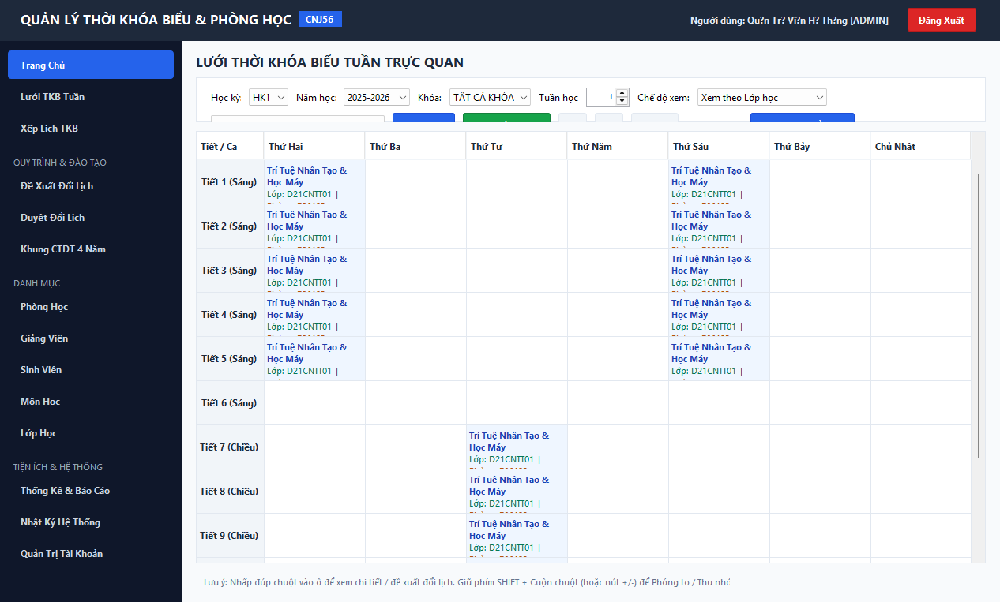
*H?nh 3.4: Giao di?n L??i Th?i Kh?a Bi?u d?ng Kh?i tr?c quan (TimetableGridPanel - Block View)*  
**M? t?:** Ch? ?? hi?n th? d?ng Kh?i (Block View) tr?c quan h?a c?c ca h?c theo c?c kh?i th?i gian s?ng v? chi?u, gi?p gi?ng vi?n v? ng??i qu?n l? d? d?ng nh?n bi?t c?c kho?ng tr?ng ph?ng h?c v? th?i gian bi?u trong tu?n.

---

### 5. M?n h?nh Th?i Kh?a Bi?u Gi?ng D?y C? Nh?n c?a Gi?ng Vi?n
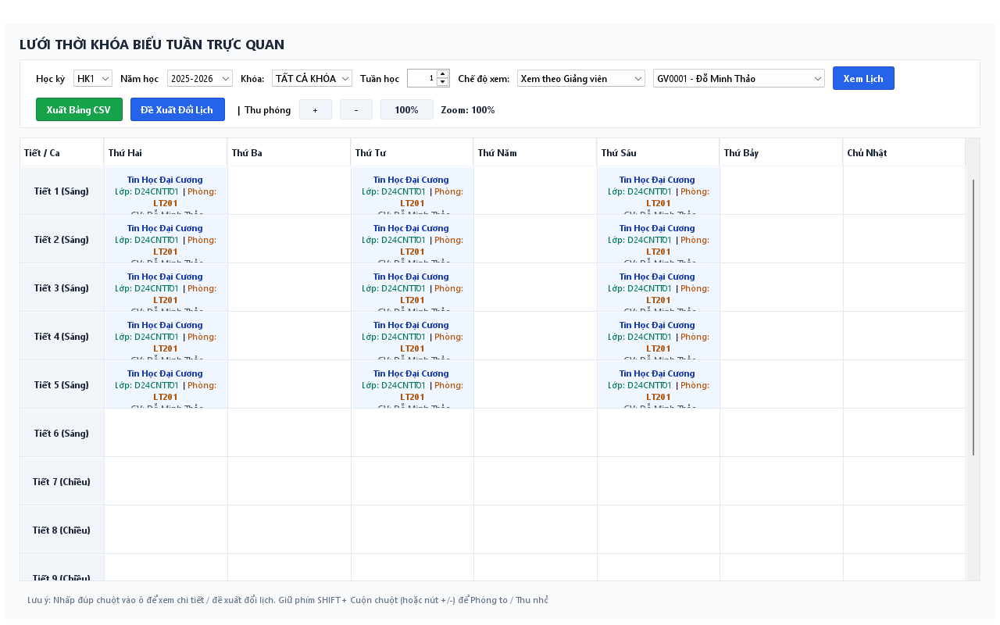
*H?nh 3.5: Giao di?n Th?i Kh?a Bi?u Gi?ng D?y c? nh?n c?a Gi?ng vi?n*  
**M? t?:** Ph?n h? chuy?n bi?t d?nh cho gi?ng vi?n tra c?u l?ch gi?ng d?y c? nh?n trong t?ng h?c k? v? tu?n h?c c? th?, hi?n th? ??y ?? t?n m?n h?c, l?p sinh vi?n ph? tr?ch, ph?ng h?c v? th?i gian b?t ??u - k?t th?c.

---

### 6. M?n h?nh Qu?n l? Danh s?ch Th?i Kh?a Bi?u & Ph?n trang (ThoiKhoaBieuPanel)
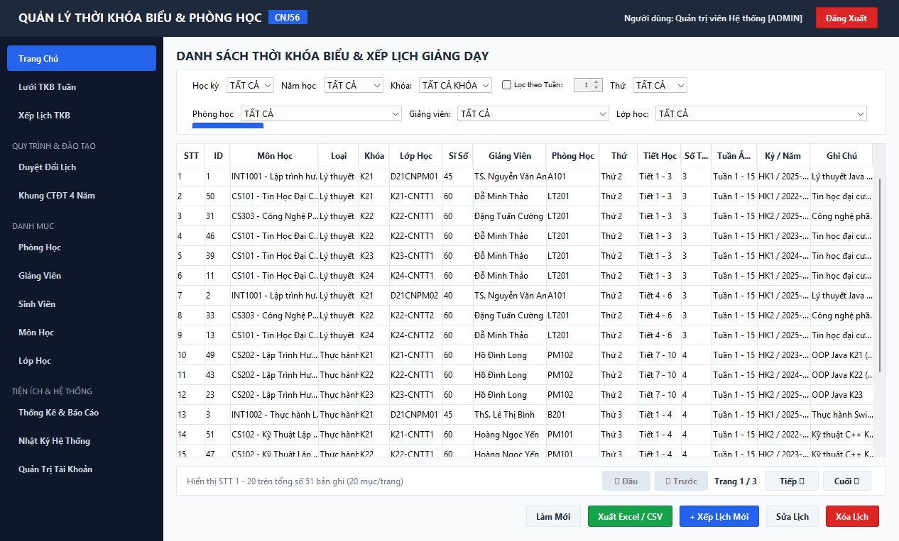
*H?nh 3.6: Giao di?n Qu?n l? Danh s?ch Th?i Kh?a Bi?u t?ch h?p Thanh ph?n trang (ThoiKhoaBieuPanel)*  
**M? t?:** B?ng d? li?u chi ti?t to?n b? c?c l?ch h?c v?i 2 h?ng b? l?c ?a ti?u ch? (H?c k?, N?m h?c, Tu?n, Th?, Ph?ng, Gi?ng vi?n, L?p), n?t Xu?t b?o c?o Excel/CSV UTF-8 v? thanh ?i?u h??ng ph?n trang `PaginationBar`.

---

### 7. H?p tho?i X?p l?ch m?i & C?nh b?o Xung ??t th?i gian th?c (XepLichDialog)
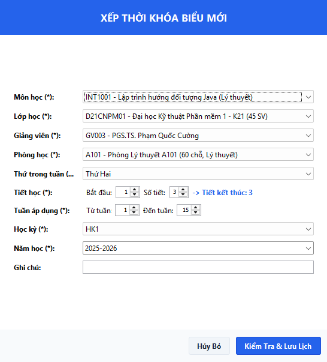
*H?nh 3.7: H?p tho?i X?p l?ch & C?nh b?o ph?t hi?n Xung ??t th?i gian th?c (XepLichDialog)*  
**M? t?:** Ti?p nh?n th?ng tin ca h?c m?i v? t? ??ng k?ch ho?t `XepLichService` ?? ph?t hi?n v? c?nh b?o t?c th?i c?c t?nh hu?ng tr?ng ph?ng, tr?ng gi?ng vi?n, tr?ng l?p h?c ho?c vi ph?m lo?i ph?ng th?c h?nh.

---

### 8. Giao di?n Gi?ng vi?n ?? xu?t ??i l?ch d?y (DeXuatDoiLichPanel)
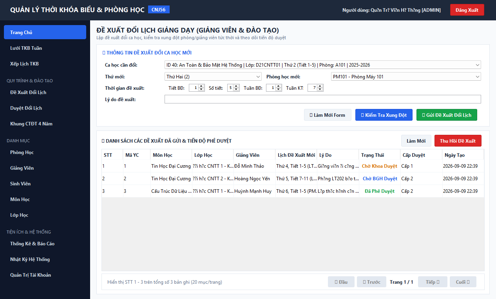
*H?nh 3.8: Giao di?n Gi?ng vi?n ?? xu?t ??i l?ch d?y v? Theo d?i tr?ng th?i ??n (DeXuatDoiLichPanel)*  
**M? t?:** Gi?ng vi?n l?a ch?n ca h?c c?n ??i, ch?n th?i gian v? ph?ng h?c m?i (h? th?ng ki?m tra xung ??t tr?c ti?p), nh?p l? do v? g?i ??n l?n c?p th?m quy?n; ??ng th?i theo d?i ti?n ?? ph? duy?t c?a Khoa v? ??o t?o.

---

### 9. Giao di?n Ph? duy?t ??i l?ch h?c 2 C?p ?? (DoiLichPanel)

*H?nh 3.9: Giao di?n Ph? duy?t ??i l?ch h?c 2 c?p ?? (DoiLichPanel)*  
**M? t?:** D?nh cho Tr??ng Khoa (ph? duy?t c?p 1) v? Ph?ng ??o t?o / Ban Gi?m Hi?u (ph? duy?t c?p 2). Khi ??n ???c duy?t ch?t, h? th?ng t? ??ng c?p nh?t ho?n ??i l?ch h?c trong b?ng `thoi_khoa_bieu` v? l?u bi?n b?n v?o `lich_su_phe_duyet`.

---

### 10. M?n h?nh Qu?n l? Ph?ng h?c & T?i nguy?n (PhongHocPanel)
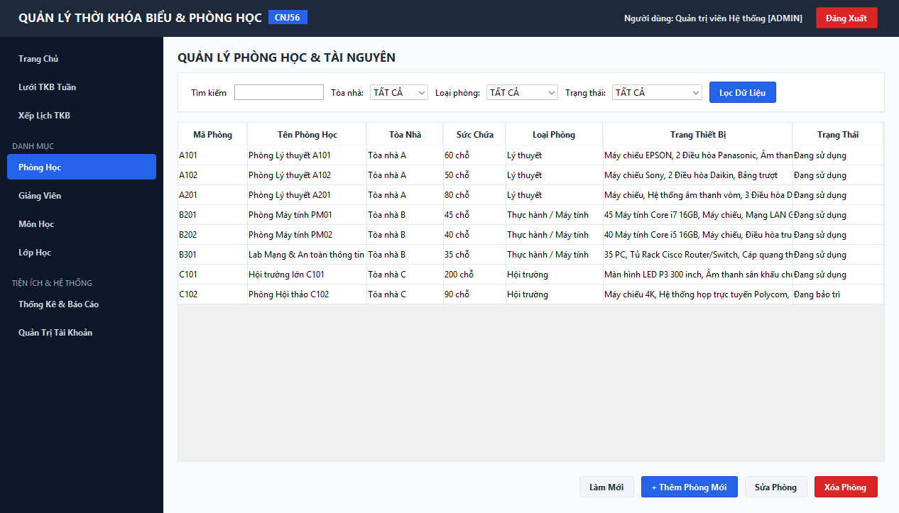
*H?nh 3.10: Giao di?n Qu?n l? Ph?ng h?c & T?i nguy?n (PhongHocPanel)*  
**M? t?:** Qu?n l? danh m?c ph?ng h?c, lo?i ph?ng (L? thuy?t, Th?c h?nh m?y t?nh, H?i tr??ng), s?c ch?a, trang thi?t b? ?i k?m v? tr?ng th?i ho?t ??ng (?ang s? d?ng / B?o tr?).

---

### 11. M?n h?nh Qu?n l? Gi?ng vi?n (GiangVienPanel)
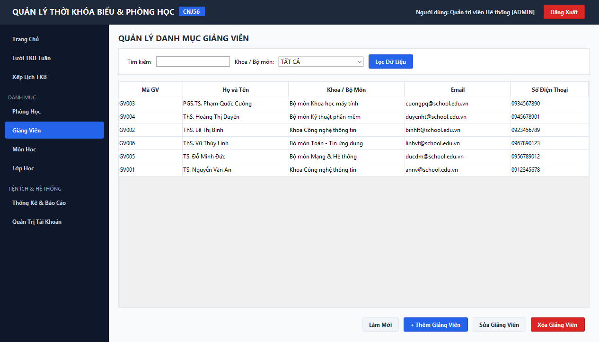
*H?nh 3.11: Giao di?n Qu?n l? Gi?ng vi?n (GiangVienPanel)*  
**M? t?:** Qu?n l? h? s? gi?ng vi?n, h?c v?, khoa/b? m?n tr?c thu?c, email v? s? ?i?n tho?i li?n h?.

---

### 12. M?n h?nh Qu?n l? M?n h?c chu?n khung CT?T (MonHocPanel)
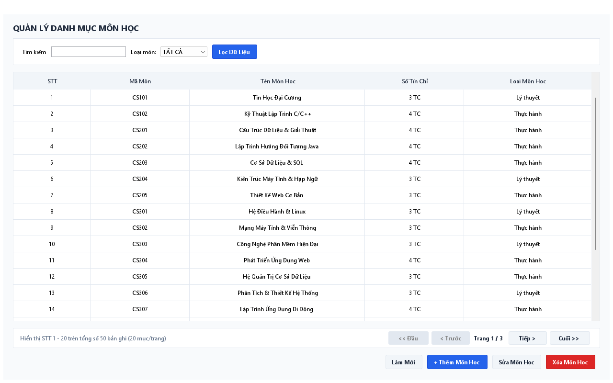
*H?nh 3.12: Giao di?n Qu?n l? M?n h?c chu?n khung CT?T (MonHocPanel)*  
**M? t?:** Qu?n l? danh m?c 42 m?n h?c trong ch??ng tr?nh ??o t?o, ph?n lo?i m?n L? thuy?t ho?c Th?c h?nh v? s? t?n ch? t??ng ?ng.

---

### 13. M?n h?nh Qu?n l? L?p h?c sinh vi?n (LopHocPanel)
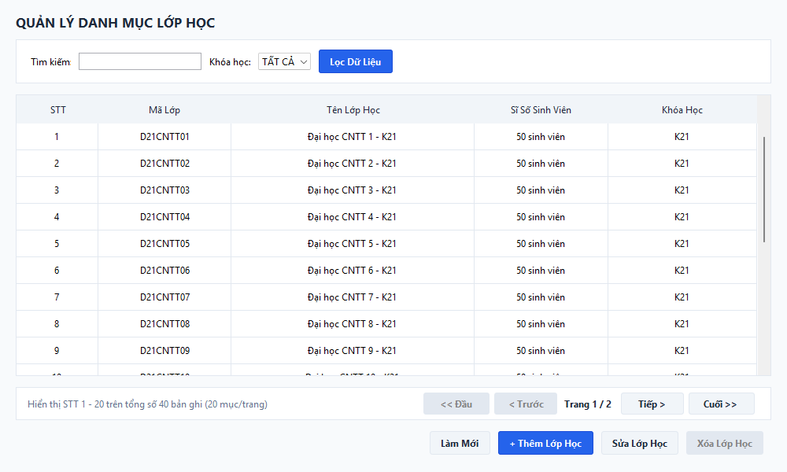
*H?nh 3.13: Giao di?n Qu?n l? L?p h?c sinh vi?n (LopHocPanel)*  
**M? t?:** Qu?n l? danh s?ch c?c l?p sinh vi?n ch?nh quy, s? s? l?p v? ni?n kh?a ??o t?o.

---

### 14. M?n h?nh Qu?n l? Sinh vi?n & Thanh Ph?n trang chu?n h?a (SinhVienPanel)
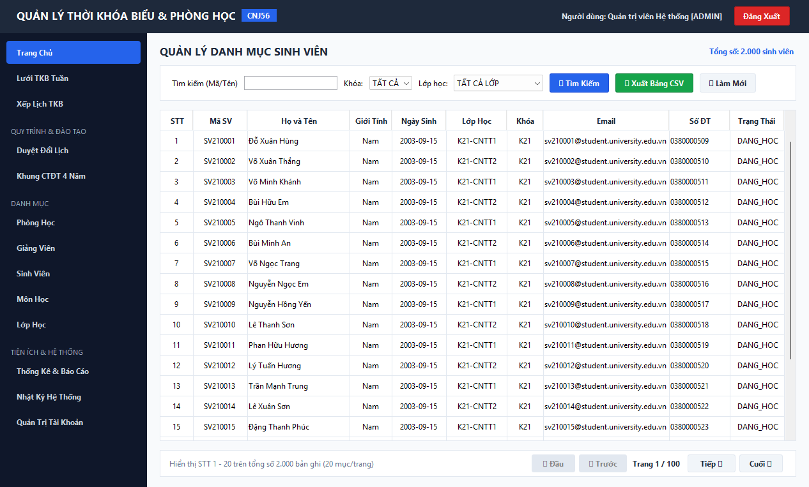
*H?nh 3.14: Giao di?n Qu?n l? Sinh vi?n t?ch h?p Thanh Ph?n trang chu?n h?a (SinhVienPanel)*  
**M? t?:** Qu?n l? danh m?c 2.000 sinh vi?n k?m ph?n trang 20 sinh vi?n/trang. H? tr? c?c n?t ?i?u h??ng: ??u, Tr??c, danh s?ch s? trang, Sau, Cu?i c?ng ch? b?o r? n?t Trang hi?n t?i / T?ng s? trang v? T?ng s? b?n ghi.

---

### 15. M?n h?nh Qu?n l? Khung Ch??ng tr?nh ??o t?o 130 T?n ch? (CurriculumPanel)
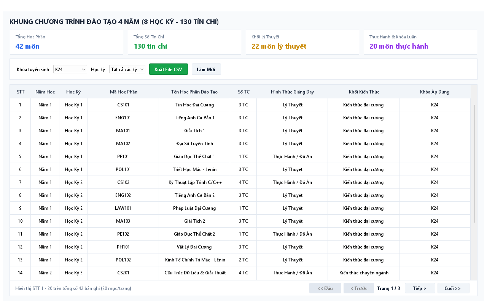
*H?nh 3.15: Giao di?n Qu?n l? Khung Ch??ng tr?nh ??o t?o 130 t?n ch? 4 n?m (CurriculumPanel)*  
**M? t?:** Qu?n l? chi ti?t to?n b? 42 m?n h?c v?i t?ng c?ng 130 t?n ch? ph?n b? chu?n h?a qua 8 h?c k? (4 n?m h?c). H? tr? l?c theo t?ng kh?a sinh vi?n (K21, K22, K23, K24, K25) v? t?nh to?n t?ng s? t?n ch? t?ch l?y.

---

### 16. M?n h?nh Nh?t k? Ki?m to?n Ho?t ??ng & An ninh H? th?ng (AuditLogPanel)
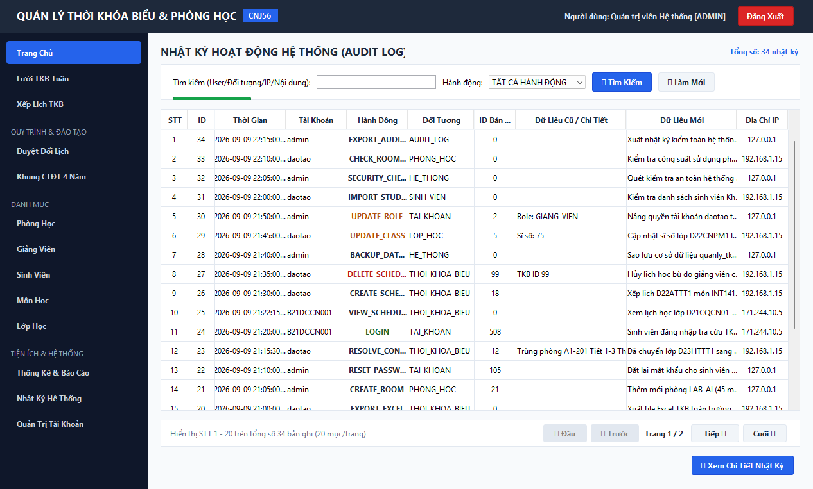
*H?nh 3.16: Giao di?n Nh?t k? Ki?m to?n Ho?t ??ng & An ninh H? th?ng (AuditLogPanel)*  
**M? t?:** Gi?m s?t to?n b? ho?t ??ng trong h? th?ng. Ghi nh?n chi ti?t: M? ng??i d?ng, T?n ??ng nh?p, H?nh ??ng, ??i t??ng t?c ??ng, D? li?u c? -> D? li?u m?i, ??a ch? IP v? D?u th?i gian ch?nh x?c t?i t?ng gi?y ph?c v? ki?m to?n v? ch?ng ch?i b?.

---

### 17. M?n h?nh Th?ng k? Gi? d?y & T?i ??o t?o Gi?ng vi?n (ThongKePanel - Gi?ng vi?n)
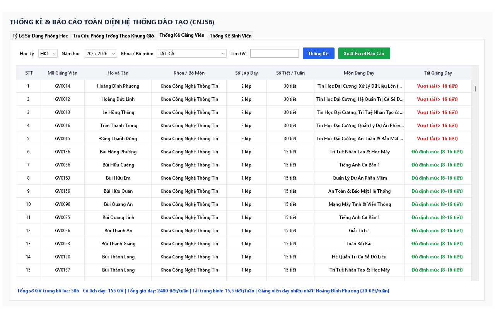
*H?nh 3.17: Giao di?n Th?ng k? Gi? d?y & T?i ??o t?o Gi?ng vi?n (ThongKePanel - Gi?ng vi?n)*  
**M? t?:** ?o l??ng t?ng s? gi? d?y, s? ti?t h?c v? t?i gi?ng d?y c?a t?ng gi?ng vi?n theo tu?n v? h?c k?, h? tr? ph?ng ??o t?o c?n ??i kh?i l??ng c?ng vi?c.

---

### 18. M?n h?nh Th?ng k? Ph?n b? Sinh vi?n theo Ni?n kh?a & L?p h?c (ThongKePanel - Sinh vi?n)
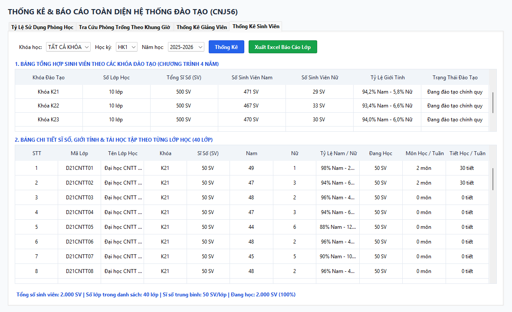
*H?nh 3.18: Giao di?n Th?ng k? Ph?n b? Sinh vi?n theo Ni?n kh?a v? L?p h?c (ThongKePanel - Sinh vi?n)*  
**M? t?:** Ph?n t?ch s? l??ng sinh vi?n theo t?ng kh?a h?c (K21 - K25) v? t?ng l?p chuy?n ng?nh, t?nh to?n t? l? ph?n b? ph?n tr?m gi?p nh? tr??ng n?m b?t quy m? ??o t?o th?c t?.

---

### 19. M?n h?nh Qu?n tr? T?i kho?n ng??i d?ng & Ph?n quy?n 6 vai tr? RBAC (TaiKhoanPanel)
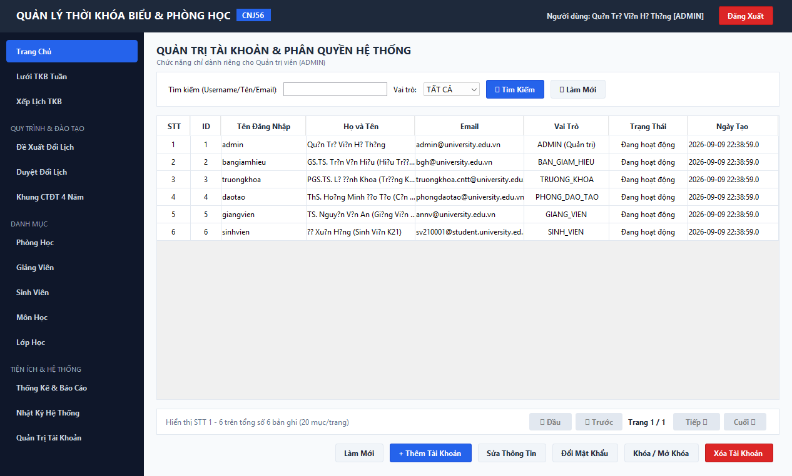
*H?nh 3.19: Giao di?n Qu?n tr? T?i kho?n ng??i d?ng & Ph?n quy?n 6 vai tr? RBAC (TaiKhoanPanel)*  
**M? t?:** Ph?n h? d?nh ri?ng cho ADMIN: th?m t?i kho?n m?i, c?p ph?t 6 vai tr? RBAC (Admin, BGH, ??o t?o, Tr??ng khoa, Gi?ng vi?n, Sinh vi?n), ??t l?i m?t kh?u v? b?t/t?t tr?ng th?i kh?a t?i kho?n ng??i d?ng.

---

## 3.5. Ki?m th? h? th?ng

**B?ng 3.1: K?ch b?n v? k?t qu? ki?m th? h? th?ng (Test Cases Result)**

| M? Test Case | T?n k?ch b?n ki?m th? | C?c b??c th?c hi?n & D? li?u ??u v?o | K?t qu? mong ??i | Tr?ng th?i |
|:---:|:---|:---|:---|:---:|
| **TC01** | X?c th?c ??ng nh?p h?p l? | Nh?p `admin` / `admin123` | ??ng nh?p th?nh c?ng, ?i?u h??ng v?o `MainForm` v?i ??y ?? menu Admin | **PASS** |
| **TC02** | Ng?n ch?n ??ng nh?p sai m?t kh?u | Nh?p `admin` / `wrongpass` | B?o l?i sai m?t kh?u, t? ch?i truy c?p | **PASS** |
| **TC03** | Kh?a t?i kho?n b? v? hi?u | ??ng nh?p t?i kho?n tr?ng th?i `0` | B?o l?i t?i kho?n ?? b? kh?a b?i Qu?n tr? vi?n | **PASS** |
| **TC04** | Ki?m th? Quick Login 6 vai tr? | Nh?p ch?n c?c n?t vai tr? nhanh t?i LoginForm | ??ng nh?p t?c th?i v?i ??ng quy?n h?n t??ng ?ng | **PASS** |
| **TC05** | Xung ??t Tr?ng Ph?ng h?c | X?p l?ch ph?ng A101 c?ng Th?, Ti?t, Tu?n v?i l?ch ?? c? | B?o l?i xung ??t ph?ng h?c, t? ch?i l?u v?o CSDL | **PASS** |
| **TC06** | Xung ??t Tr?ng Gi?ng vi?n | X?p GV0001 d?y 2 l?p kh?c nhau c?ng m?t khung gi? | B?o l?i gi?ng vi?n ?ang b?n gi?ng d?y | **PASS** |
| **TC07** | Xung ??t Tr?ng L?p h?c | X?p l?p D21CNPM1 h?c 2 m?n c?ng th?i ?i?m | B?o l?i l?p sinh vi?n ?ang c? l?ch h?c | **PASS** |
| **TC08** | Kh?a ph?ng ?ang b?o tr? | X?p l?ch v?o ph?ng c? tr?ng th?i `BAO_TRI` | T? ch?i x?p l?ch, y?u c?u ch?n ph?ng ?ang s? d?ng | **PASS** |
| **TC09** | R?ng bu?c lo?i ph?ng th?c h?nh | M?n `THUC_HANH` x?p v?o ph?ng `LY_THUYET` | T? ch?i x?p l?ch, y?u c?u ch?n ph?ng m?y t?nh | **PASS** |
| **TC10** | C?nh b?o qu? t?i s?c ch?a | X?p l?p s? s? 80 v?o ph?ng s?c ch?a 50 | Hi?n th? h?p tho?i c?nh b?o v??t qu? s?c ch?a | **PASS** |
| **TC11** | ?? xu?t ??i l?ch c?a Gi?ng vi?n | Gi?ng vi?n g?i ??n ??i ca d?y (ch?n ph?ng v? gi? m?i) | ??n ???c t?o th?nh c?ng, chuy?n sang tr?ng th?i `CHO_KHOA_DUYET` | **PASS** |
| **TC12** | Ph? duy?t ??i l?ch 2 c?p | Tr??ng Khoa duy?t c?p 1 -> ??o t?o duy?t c?p 2 | ??n chuy?n sang `DA_PHE_DUYET`, TKB t? ??ng ho?n ??i | **PASS** |
| **TC13** | Ph?n trang danh s?ch sinh vi?n | Chuy?n gi?a trang 1, 2, 3 v? l?c theo l?p | D? li?u hi?n th? ??ng 20 m?c/trang, kh?ng m?t tr?ng th?i ph?n trang | **PASS** |
| **TC14** | Ghi nh?n Audit Log an ninh | Th?c hi?n ??i m?t kh?u ho?c x?p l?ch m?i | B?n ghi m?i xu?t hi?n trong `AuditLogPanel` k?m IP v? th?i gian | **PASS** |
| **TC15** | Xu?t b?o c?o Excel UTF-8 BOM | Nh?n n?t Xu?t Excel t?i ThoiKhoaBieuPanel | File CSV/Excel m? b?ng MS Excel hi?n th? ??ng ti?ng Vi?t c? d?u | **PASS** |

---

# K?T LU?N

## 1. K?t qu? thu ???c c?a ?? t?i
Qua qu? tr?nh nghi?n c?u, thi?t k? v? ph?t tri?n ?? t?i **CNJ56: "X?y d?ng ?ng d?ng desktop qu?n l? th?i kh?a bi?u v? t?i nguy?n ph?ng h?c"**, nh?m sinh vi?n ?? ??t ???c c?c k?t qu? n?i b?t sau:
1. **X?y d?ng ho?n ch?nh ?ng d?ng Desktop Java Swing chuy?n nghi?p:**
   - ?ng d?ng tu?n th? chu?n ki?n tr?c ph?n t?ng (Presentation -> Controller -> Service -> DAO -> Database).
   - T??ng th?ch ho?n to?n v?i m?i tr??ng NetBeans IDE, m?y ch? XAMPP MySQL.
2. **C?i ??t th?nh c?ng thu?t to?n ki?m tra xung ??t th?i kh?a bi?u th?i gian th?c 6 chi?u:**
   - Gi?i quy?t tri?t ?? b?i to?n x?p l?ch trong kh?ng gian ?a chi?u (Th?i gian $\times$ T?i nguy?n $\times$ Gi?ng vi?n $\times$ L?p h?c).
   - T? ??ng ph?t hi?n v? ng?n ch?n t?c th?i tr?ng ph?ng, tr?ng gi?ng vi?n, tr?ng l?p, sai lo?i ph?ng th?c h?nh, ph?ng ?ang b?o tr? v? c?nh b?o v??t s?c ch?a.
3. **Tri?n khai th?nh c?ng c?c module n?ng cao:**
   - L??i TKB ?a chi?u: Ma tr?n 12 ti?t x 7 ng?y, L??i d?ng Kh?i (Block View), TKB gi?ng d?y c? nh?n c?a gi?ng vi?n.
   - Quy tr?nh ??i l?ch 2 c?p ?? ho?n ch?nh (Khoa duy?t c?p 1 -> ??o t?o duy?t c?p 2).
   - Qu?n l? khung ch??ng tr?nh ??o t?o chu?n ??i h?c 130 t?n ch? 4 n?m (42 m?n h?c cho c?c kh?a K21 - K25).
   - Qu?n l? sinh vi?n t?ch h?p thanh ph?n trang chu?n h?a `PaginationBar`.
   - Nh?t k? ki?m to?n an ninh h? th?ng `AuditLog` ch?ng ch?i b? tr?ch nhi?m.
4. **B?o m?t v? to?n v?n d? li?u:**
   - ?p d?ng thu?t to?n b?m m?t chi?u SHA-256 b?o v? m?t kh?u ng??i d?ng.
   - 100% c?u l?nh truy v?n s? d?ng JDBC PreparedStatement ch?ng t?n c?ng SQL Injection.
   - C? s? d? li?u quan h? ??t chu?n 3NF v?i c?c r?ng bu?c kh?a ngo?i ch?t ch?.

## 2. H?n ch? v? h??ng ph?t tri?n c?a ?? t?i
- **H?n ch?:** H? th?ng hi?n t?i ho?t ??ng theo c? ch? h? tr? x?p l?ch b?n t? ??ng (Interactive Assisted Scheduling), ch?a t? ??ng x?p l?ch 100% t? ??ng ho?n to?n cho to?n tr??ng b?ng thu?t to?n t?i ?u h?a to?n c?c.
- **H??ng ph?t tri?n trong t??ng lai:**
  1. Nghi?n c?u v? ?ng d?ng **Thu?t to?n Di truy?n (Genetic Algorithm - GA)** ho?c **T?m ki?m C?m (Tabu Search)** ?? t? ??ng sinh th?i kh?a bi?u t?i ?u cho to?n tr??ng ch? b?ng m?t n?t b?m.
  2. Ph?t tri?n h? sinh th?i ?a n?n t?ng: X?y d?ng h? th?ng Backend API (Spring Boot RESTful API) v? ?ng d?ng di ??ng (Flutter / React Native) ?? gi?ng vi?n v? sinh vi?n tra c?u TKB tr?c ti?p tr?n ?i?n tho?i th?ng minh.
  3. M? r?ng Qu?n l? Thi?t b? & T?i nguy?n th?ng minh b?ng c?ng ngh? m? v?ch / QR Code g?n t?i t?ng ph?ng h?c.

---

# DANH M?C T?I LI?U THAM KH?O

1. Oracle Corporation, *"Java? Platform, Standard Edition 8 API Specification"*, docs.oracle.com/javase/8/docs/api/.
2. Oracle Corporation, *"MySQL 8.0 Reference Manual & Connector/J Documentation"*, dev.mysql.com/doc/.
3. Apache Software Foundation, *"NetBeans IDE Documentation & GUI Builder Tutorial"*, netbeans.apache.org.
4. Unicode Consortium, *"The Unicode Standard ? UTF-8 Byte Order Mark"*, unicode.org.
5. ?o?n V?n Ban, *Gi?o tr?nh L?p tr?nh H??ng ??i t??ng v?i Java*, NXB Khoa h?c v? K? thu?t.
6. ?? Trung Tu?n, *Gi?o tr?nh C? s? D? li?u*, NXB ??i h?c Qu?c gia H? N?i.
7. Robert C. Martin, *Clean Architecture: A Craftsman's Guide to Software Structure and Design*, Prentice Hall.
8. Edmund Burke, Dave Corne, *Automated Timetabling: Practice and Theory*, Springer.
