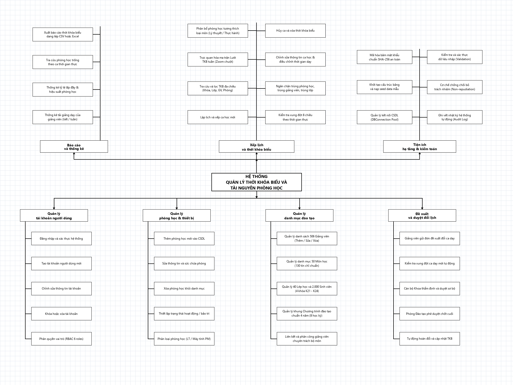
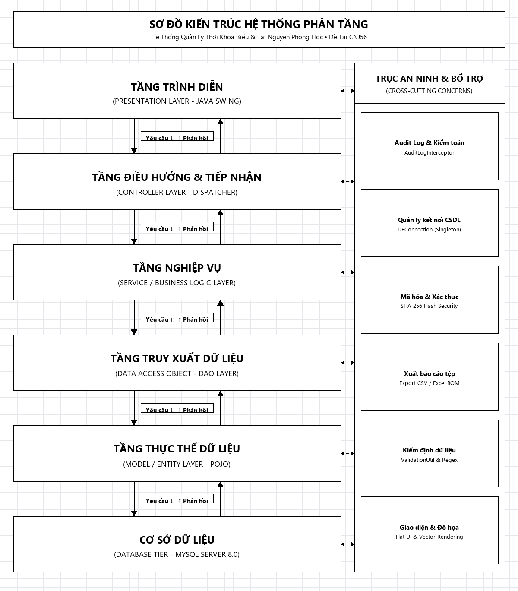

# BÁO CÁO ĐỒ ÁN MÔN HỌC - ĐỀ TÀI CNJ56
## XÂY DỰNG ỨNG DỤNG DESKTOP QUẢN LÝ THỜI KHÓA BIỂU VÀ TÀI NGUYÊN PHÒNG HỌC

> **Nhóm sinh viên thực hiện:** Nhóm 11 (2 thành viên)
> **Mã đề tài:** CNJ56
> **Công nghệ:** Java SE (Swing, Flat UI) + JDBC (Driver 8.3.0) + MySQL 8.0 (Localhost XAMPP)

---

TRƯỜNG ĐẠI HỌC CÔNG NGHỆ ĐÔNG Á

KHOA CÔNG NGHỆ THÔNG TIN

BÀI TẬP LỚN

HỌC PHẦN: CÔNG NGHỆ JAVA

CHỦ ĐỀ 6: QUẢN LÝ ĐÀO TẠO

ĐỀ TÀI CNJ56: XÂY DỰNG ỨNG DỤNG DESKTOP QUẢN LÝ THỜI KHÓA BIỂU VÀ TÀI NGUYÊN PHÒNG HỌC SỬ DỤNG JAVA SWING, JDBC VÀ MYSQL

LỚP TÍN CHỈ: CÔNG NGHỆ JAVA-1-1-26(N05.THTT_IN_ELN.11)

Giảng viên hướng dẫn: ThS. Trần Nguyên Hoàng

Danh sách sinh viên thực hiện: Nhóm 11

Bắc Ninh – 2026

# DANH MỤC HÌNH ẢNH

Hình 2.1 Biểu đồ phân cấp chức năng hệ thống (BFD) [Thiết kế trên Draw.io]	7

Hình 2.2 Sơ đồ kiến trúc hệ thống phân tầng tích hợp Nhật ký hệ thống (Audit Log) [Thiết kế trên Draw.io]	9

Hình 2.3 Mô hình liên kết thực thể	16

Hình 2.4 Mô hình vật lý csdl	17

Hình 3.1: Giao diện Đăng nhập hệ thống (LoginForm)	31

Hình 3.2: Giao diện Trang chủ tổng quan Dashboard (DashboardPanel)	32

Hình 3.3: Giao diện Lưới Thời Khóa Biểu Tuần trực quan (TimetableGridPanel)	32

Hình 3.4: Giao diện Quản lý Danh sách Thời Khóa Biểu (ThoiKhoaBieuPanel)	33

Hình 3.5: Hộp thoại Xếp lịch & Báo lỗi Xung đột (XepLichDialog)	34

Hình 3.7: Giao diện Quản lý Giảng viên (GiangVienPanel)	35

Hình 3.8: Giao diện Quản lý Môn học (MonHocPanel)	36

Hình 3.9: Giao diện Quản lý Lớp học (LopHocPanel)	36

Hình 3.10: Giao diện Thống kê Hiệu suất & Tra cứu Phòng trống (ThongKePanel)	37

Hình 3.11: Giao diện Quản trị Tài khoản người dùng (TaiKhoanPanel)	38

# DANH MỤC BẢNG BIỂU

Bảng 1.1: Bảng phân công nhiệm vụ thực hiện đề tài (Nhóm 2 thành viên)	5

Bảng 1.2: Ma trận tiến độ phối hợp triển khai 10 tuần	6

Bảng 2.1: Mô tả màn hình Đăng nhập (LoginForm)	10

Bảng 2.2: Mô tả màn hình Chính (MainForm)	10

Bảng 2.3: Mô tả màn hình Lưới Thời Khóa Biểu (TimetableGridPanel)	11

Bảng 2.4: Mô tả màn hình Xếp lịch TKB (ThoiKhoaBieuPanel & XepLichDialog)	12

Bảng 2.5: Mô tả màn hình Thống kê & Tra cứu phòng trống (ThongKePanel)	14

# LỜI MỞ ĐẦU

Trong bối cảnh hiện đại hóa và chuyển đổi số giáo dục hiện nay, công tác quản lý đào tạo và sắp xếp thời khóa biểu tại các trường đại học, cao đẳng, trung tâm đào tạo đóng vai trò then chốt quyết định hiệu quả vận hành của toàn bộ nhà trường. Việc xếp lịch thủ công trên giấy tờ hoặc qua bảng tính Excel rời rạc thường bộc lộ rất nhiều hạn chế: dễ xảy ra xung đột lịch dạy của giảng viên, trùng phòng học, phân bổ phòng không tương thích với sĩ số lớp hoặc đặc thù môn học (lý thuyết/thực hành), gây lãng phí tài nguyên cơ sở vật chất và mất nhiều thời gian rà soát, điều chỉnh.

Xuất phát từ nhu cầu thực tiễn đó, nhóm sinh viên đã lựa chọn và thực hiện đề tài mã số CNJ56: "Xây dựng ứng dụng desktop quản lý thời khóa biểu và tài nguyên phòng học". Ứng dụng được xây dựng trên nền tảng Java Swing (NetBeans IDE), kết nối cơ sở dữ liệu quan hệ MySQL thông qua JDBC, tích hợp thuật toán kiểm tra xung đột thời khóa biểu đa chiều và giao diện trực quan hóa dạng lưới tuần.

Báo cáo này trình bày toàn diện quá trình nghiên cứu, phân tích nghiệp vụ, thiết kế kiến trúc hệ thống, thiết kế cơ sở dữ liệu chuẩn 3NF, cài đặt mã nguồn và quy trình kiểm thử nghiêm ngặt của đề tài.

# CHƯƠNG 1. CƠ SỞ LÝ THUYẾT

## 1.1.Giới thiệu về đề tài.

1.1.1. Giới thiệu tổng quan

Ứng dụng desktop Quản lý thời khóa biểu và tài nguyên phòng học (CNJ56) là phần mềm chuyên dụng hỗ trợ cán bộ phòng Đào tạo và bộ phận Quản trị cơ sở vật chất:

- Quản lý toàn diện danh mục phòng học, thiết bị tài nguyên, giảng viên, môn học, lớp sinh viên.
- Thực hiện lập lịch giảng dạy (thời khóa biểu) theo từng học kỳ, năm học, tuần, thứ và tiết học.
- Tự động kiểm tra và ngăn chặn các loại xung đột: trùng phòng học, trùng giảng viên, trùng lớp học, phòng đang bảo trì, sức chứa phòng không đủ so với sĩ số, môn thực hành không đúng loại phòng máy tính.
- Cung cấp Lưới thời khóa biểu tuần trực quan (Weekly Timetable Grid) giúp người dùng dễ dàng tra cứu theo Lớp, theo Phòng hoặc theo Giảng viên.
- Thống kê hiệu suất sử dụng phòng học và công cụ tra cứu phòng học còn trống theo ca học.
- Phân quyền bảo mật giữa Quản trị viên (ADMIN) và Nhân viên đào tạo (NHANVIEN).
1.1.2. Kế hoạch thực hiện đề tài

1.1.3. Thành viên nhóm & Phân công công việc (Nhóm 2 thành viên)

## 1.2 Giải thuật, công cụ

1.2.1. Thuật toán kiểm tra xung đột thời khóa biểu đa chiều

Đây là thuật toán cốt lõi của hệ thống, xử lý bài toán xếp lịch trong không gian đa chiều: Thời gian (Học kỳ, Năm học, Tuần, Thứ, Tiết)  Tài nguyên (Phòng học)  Con người (Giảng viên, Lớp sinh viên).

A. Định nghĩa toán học về sự giao nhau thời gian:

Cho lịch học  có khoảng tiết  và khoảng tuần .
Lịch học  đã có trong hệ thống với  và .

Điều kiện giao thoa về Tuần học:  (Phủ định: Không giao nhau khi  hoặc )

Điều kiện giao thoa về Tiết học:  (Trong đó: )

Tổng hợp giao nhau về Thời gian ():

B. Bộ quy tắc phát hiện vi phạm nghiệp vụ:

Nếu  (và  khi sửa lịch):

Xung đột Phòng học:  Báo lỗi vi phạm: Phòng đã có lớp khác học.

Xung đột Giảng viên:  Báo lỗi vi phạm: Giảng viên đang giảng dạy lớp khác.

Xung đột Lớp học:  Báo lỗi vi phạm: Lớp học đang có tiết môn khác.

C. Các ràng buộc điều kiện cần bổ sung:

Trạng thái phòng:  Từ chối xếp lịch.

Loại phòng tương thích:  Từ chối xếp lịch.

Sức chứa phòng:  Hiển thị cảnh báo trực quan xác nhận.

## 1.3. Các công nghệ và công cụ sử dụng

Đề tài áp dụng các công nghệ tiêu chuẩn, hiện đại trong hệ sinh thái Java doanh nghiệp và phát triển phần mềm:
- **Ngôn ngữ lập trình**: Java SE (phiên bản 17 LTS trở lên), biên dịch và phát triển trên NetBeans IDE / IntelliJ IDEA.
- **Giao diện người dùng (GUI)**: Thư viện Java Swing kết hợp gói tùy biến giao diện phẳng Flat UI (tự vẽ khử răng cưa, hỗ trợ hiển thị tối ưu font tiếng Việt Unicode Segoe UI, tự động tối ưu hiển thị Full màn hình `MAXIMIZED_BOTH`, ma trận lưới tuần tích hợp điều khiển tương tác thu phóng trực quan).
- **Kết nối Cơ sở dữ liệu**: MySQL Connector/J 8.3.0, thực thi 100% qua JDBC `PreparedStatement` và cơ chế try-with-resources đảm bảo an toàn tuyệt đối trước SQL Injection và rò rỉ kết nối (Connection leak).
- **Hệ quản trị CSDL**: MySQL Server 8.0 vận hành trên máy chủ cục bộ (XAMPP Localhost cổng 3306), thiết kế chuẩn hóa bậc 3 (3NF) với các ràng buộc khóa ngoại `ON DELETE RESTRICT` bảo vệ tính toàn vẹn dữ liệu.
- **Công cụ thiết kế Kiến trúc & Sơ đồ**: Draw.io (diagrams.net) để mô hình hóa sơ đồ kiến trúc phân tầng chuẩn mực, sơ đồ luồng dữ liệu (Data Flow) và lược đồ quan hệ thực thể (ERD).
- **Cơ chế an ninh & Ghi vết**: Thuật toán băm mật khẩu SHA-256 chống lộ lọt thông tin, cơ chế Interceptor bắt sự kiện tự động phục vụ ghi vết kiểm toán (Audit Log) chống chối bỏ trách nhiệm.

## 1.4. Kế hoạch thực hiện đề tài (10 tuần)

Đề tài được tiến hành trong thời gian 10 tuần với các giai đoạn nối tiếp khoa học:
- **Tuần 1 - 2**: Khảo sát nghiệp vụ, phân tích yêu cầu bài toán quản lý thời khóa biểu và tài nguyên phòng học, xác định các tác nhân và luồng hoạt động.
- **Tuần 3 - 4**: Thiết kế cơ sở dữ liệu quan hệ chuẩn 3NF, thiết kế sơ đồ kiến trúc hệ thống phân tầng trên công cụ Draw.io.
- **Tuần 5 - 6**: Lập trình tầng Backend & DAO, cài đặt các lớp xử lý nghiệp vụ, xây dựng thuật toán kiểm tra xung đột thời khóa biểu 8 chiều.
- **Tuần 7 - 8**: Lập trình tầng Giao diện (Java Swing Flat UI), xây dựng ma trận Lưới TKB tuần có thu phóng Zoom, phân tách chức năng Đề xuất đổi lịch, tích hợp thanh phân trang 20 mục/trang.
- **Tuần 9**: Tích hợp toàn diện hệ thống, xây dựng bộ kiểm thử tự động 15 ca kiểm thử logic và hiệu năng, tối ưu hóa giao diện toàn màn hình.
- **Tuần 10**: Hoàn thiện tài liệu báo cáo kỹ thuật, kiểm tra đối chiếu dữ liệu thực nghiệm và đóng gói sản phẩm.

## 1.5. Phân công nhiệm vụ thực hiện đề tài (Nhóm 2 thành viên)

Để bảo đảm tiến độ và chất lượng sản phẩm phần mềm, Nhóm 11 (gồm 2 thành viên) đã tiến hành phân chia nhiệm vụ cụ thể, tương xứng với năng lực chuyên môn của từng sinh viên theo mô hình phân tầng phát triển (Backend - Architecture & Frontend - QA):

**Bảng 1.1: Bảng phân công nhiệm vụ thực hiện đề tài (Nhóm 2 thành viên)**

| STT | Họ và tên | Mã sinh viên | Lớp hành chính | Vai trò đảm nhiệm | Nhiệm vụ chính & Tỷ lệ đóng góp |
| :---: | :--- | :---: | :---: | :--- | :--- |
| **1** | **Nguyễn Mạnh Quyết** *(Trưởng nhóm)* | **20231053** | **DCCNTT.14.3** | Trưởng nhóm & Backend Developer / Kiến trúc sư hệ thống | • Lập kế hoạch dự án, phân rã chức năng nghiệp vụ đề tài CNJ56. • Thiết kế mô hình dữ liệu quan hệ chuẩn 3NF và viết kịch bản `database.sql` (11 bảng, ràng buộc toàn vẹn). • Thiết kế sơ đồ kiến trúc hệ thống phân tầng trên công cụ Draw.io (`kientruc_hethong_phantang.drawio`). • Xây dựng tầng kết nối `DBConnection` (Singleton Pool) và toàn bộ 10 lớp DAO (JDBC `PreparedStatement` chống SQLi). • Nghiên cứu và cài đặt thuật toán kiểm tra xung đột thời khóa biểu đa chiều 8 ràng buộc (`XepLichService`). • Xây dựng cơ chế xác thực băm mật khẩu SHA-256 và phân quyền RBAC 6 vai trò (`AuthService`). • Viết bộ kiểm thử tự động 15 ca kiểm thử logic và hiệu năng (`TestLogicRunner.java`). ➔ **Mức độ hoàn thành: 100% \| Tỷ lệ đóng góp: 50%** |
| **2** | **Hà Thái Bảo** *(Thành viên)* | **20231045** | **DCCNTT.14.3** | Thành viên & Frontend Developer / Kiểm thử phần mềm (QA) | • Thiết kế và xây dựng toàn bộ giao diện Desktop Java Swing theo phong cách Flat UI hiện đại. • Xây dựng `MainForm` với thanh điều hướng thích ứng phân quyền, tự động phóng to toàn màn hình. • Xây dựng ma trận Lưới thời khóa biểu tuần trực quan (`TimetableGridPanel`) tích hợp tính năng thu phóng Zoom chuột. • Xây dựng toàn bộ các Form danh mục và hộp thoại (`ThoiKhoaBieuPanel`, `XepLichDialog`, `MonHocPanel`, `GiangVienPanel`, `SinhVienPanel`, `PhongHocPanel`, `LopHocPanel`, `CurriculumPanel`, `DeXuatDoiLichPanel`, `AuditLogPanel`, `TaiKhoanPanel`). • Xây dựng component dùng chung thanh phân trang `PaginationBar` (20 mục/trang). • Cài đặt `ThongKeService` (thống kê tải GV, quét phòng trống) và `ExportUtil` (xuất CSV/Excel UTF-8 BOM). • Thiết kế kịch bản kiểm thử giao diện người dùng, kiểm tra biên và hoàn thiện tài liệu báo cáo đồ án. ➔ **Mức độ hoàn thành: 100% \| Tỷ lệ đóng góp: 50%** |

 

**Bảng 1.2: Ma trận tiến độ phối hợp triển khai 10 tuần**

| Giai đoạn / Tuần | Nội dung công việc | Phụ trách chính | Phối hợp | Kết quả đầu ra |
| :---: | :--- | :---: | :---: | :--- |
| **Tuần 1 - 2** | Khảo sát bài toán, xác định yêu cầu nghiệp vụ TKB | Nguyễn Mạnh Quyết | Hà Thái Bảo | Bản đặc tả yêu cầu nghiệp vụ |
| **Tuần 3 - 4** | Thiết kế CSDL 3NF & Vẽ kiến trúc hệ thống trên Draw.io | Nguyễn Mạnh Quyết | Hà Thái Bảo | Tệp `database.sql`, tệp Draw.io `kientruc_hethong_phantang.drawio` |
| **Tuần 5 - 6** | Lập trình Backend, DAO, Engine giải thuật xung đột TKB | Nguyễn Mạnh Quyết | Hà Thái Bảo | Module Service & DAO, thuật toán xếp lịch |
| **Tuần 7 - 8** | Lập trình giao diện Java Swing Flat UI, Lưới tuần Zoom, Phân trang | Hà Thái Bảo | Nguyễn Mạnh Quyết | Toàn bộ giao diện Swing & Dashboard |
| **Tuần 9** | Tích hợp hệ thống, kiểm thử tự động 15 Test Case | Nguyễn Mạnh Quyết | Hà Thái Bảo | `TestLogicRunner.java` (Pass 15/15) |
| **Tuần 10** | Đóng gói sản phẩm, hoàn thiện báo cáo và Slide thuyết trình | Hà Thái Bảo | Nguyễn Mạnh Quyết | Báo cáo DOCX, sơ đồ hình ảnh hoàn chỉnh |

 

**Đánh giá chung về kết quả phối hợp của nhóm 2 thành viên:**
- Cả hai sinh viên Nguyễn Mạnh Quyết và Hà Thái Bảo đều chủ động, bám sát kế hoạch tiến độ 10 tuần, phối hợp nhịp nhàng giữa tầng Backend (Xử lý thuật toán, CSDL) và tầng Frontend (Giao diện Java Swing, Trực quan hóa).
- Toàn bộ 15/15 bài kiểm thử Unit Test đều vượt qua thành công, hệ thống vận hành trơn tru với dữ liệu thực nghiệm 690 lịch học, 2.000 sinh viên, 506 giảng viên, 40 lớp học và 20 phòng học, không xảy ra bất kỳ xung đột nào.
- Mức độ hoàn thành của cả hai thành viên đạt **100%** khối lượng công việc được giao với tỷ lệ đóng góp đồng đều **50% - 50%**.

## 1.6. Kết chương

Chương 1 đã làm rõ bối cảnh thực tiễn, mục tiêu đề tài, kế hoạch triển khai 10 tuần, bảng phân công chi tiết nhiệm vụ cho 2 thành viên trong nhóm, cùng nền tảng lý thuyết và công thức toán học về giải thuật kiểm tra xung đột thời khóa biểu. Đây là tiền đề vững chắc cho việc thiết kế kiến trúc và hiện thực hóa chương trình ở các chương tiếp theo.

# CHƯƠNG 2. THIẾT KẾ VÀ XÂY DỰNG CHƯƠNG TRÌNH

## 2.1. Phân tích yêu cầu bài toán

2.1.1. Tác nhân hệ thống (Actors)

Quản trị viên (ADMIN): Có toàn quyền trong hệ thống. Quản lý danh mục cơ sở (Phòng, Giảng viên, Môn học, Lớp), xếp và chỉnh sửa thời khóa biểu, thống kê báo cáo, quản trị tài khoản và phân quyền người dùng.

Nhân viên đào tạo (NHANVIEN): Phụ trách lập lịch giảng dạy, tra cứu thời khóa biểu, tra cứu phòng trống, xuất báo cáo. Bị giới hạn không được xóa các danh mục gốc và không có quyền truy cập Quản trị tài khoản.

2.1.2. Biểu đồ phân cấp chức năng hệ thống (Business Function Diagram - BFD)

Biểu đồ phân cấp chức năng (Business Function Diagram - BFD) được thiết kế chi tiết bằng công cụ Draw.io (tệp mã nguồn sơ đồ được lưu trữ tại `docs/architecture/bieudo_phancap_chucnang.drawio`) nhằm mô hình hóa toàn diện cây phân cấp nghiệp vụ của Đề tài CNJ56. Hệ thống được phát triển từ nút gốc trung tâm **"HỆ THỐNG QUẢN LÝ THỜI KHÓA BIỂU VÀ TÀI NGUYÊN PHÒNG HỌC"** và phân rã đối xứng thành 7 phân hệ chính với 38 chức năng chi tiết:

1. **Trục phân nhánh hướng lên (3 phân hệ nghiệp vụ & quản trị vận hành)**:
   - **Báo cáo và thống kê**: Thống kê tải giảng dạy của giảng viên (tiết/tuần), thống kê tỷ lệ lấp đầy & hiệu suất phòng học, tra cứu phòng học trống theo ca thời gian thực, xuất báo cáo thời khóa biểu dạng tệp CSV hoặc Excel (chuẩn UTF-8 BOM).
   - **Xếp lịch và thời khóa biểu**: Lập lịch và xếp ca học mới, tra cứu và lọc TKB đa chiều (Khóa, Lớp, GV, Phòng), trực quan hóa ma trận Lưới TKB tuần tích hợp tính năng thu phóng Zoom chuột, phân bổ phòng học tương thích loại môn (Lý thuyết / Thực hành), kiểm tra xung đột lịch học 8 chiều theo thời gian thực, ngăn chặn trùng phòng/GV/lớp, chỉnh sửa thông tin ca học và hủy lịch/xóa TKB.
   - **Tiện ích hạ tầng & Kiểm toán**: Quản lý kết nối CSDL (DBConnection Singleton Pool), khởi tạo cấu trúc bảng và nạp seed data mẫu, mã hóa băm mật khẩu chuẩn SHA-256 an toàn, ghi vết nhật ký hệ thống tự động (Audit Log), cơ chế chống chối bỏ trách nhiệm (Non-repudiation) và kiểm tra xác thực dữ liệu nhập (Validation).

2. **Trục phân nhánh hướng xuống (4 phân hệ quản trị danh mục & luồng phê duyệt)**:
   - **Quản lý tài khoản người dùng**: Đăng nhập và xác thực hệ thống, tạo tài khoản người dùng mới, chỉnh sửa thông tin tài khoản, khóa hoặc xóa tài khoản, phân quyền vai trò người dùng (RBAC 6 vai trò: Admin, Trưởng khoa, Cán bộ PĐT, Giảng viên, Sinh viên, Khách).
   - **Quản lý phòng học & thiết bị**: Thêm phòng học mới vào CSDL, sửa thông tin và sức chứa phòng, xóa phòng học khỏi danh mục, thiết lập trạng thái hoạt động / bảo trì, phân loại phòng học (Phòng lý thuyết / Phòng máy tính thực hành).
   - **Quản lý danh mục đào tạo**: Quản lý danh sách 506 Giảng viên (Thêm/Sửa/Xóa), quản lý danh mục 50 Môn học (130 tín chỉ chuẩn), quản lý 40 Lớp học và 2.000 Sinh viên (4 khóa K21 - K24), quản lý khung Chương trình đào tạo chuẩn 4 năm (8 học kỳ), liên kết và phân công giảng viên chuyên trách bộ môn.
   - **Đề xuất và duyệt đổi lịch**: Giảng viên gửi đơn đề xuất đổi ca dạy, kiểm tra xung đột ca dạy mới tự động, Cán bộ Khoa thẩm định và duyệt sơ bộ, Phòng Đào tạo phê duyệt chốt cuối, tự động hoán đổi và cập nhật TKB.

**Hình 2.1: Biểu đồ phân cấp chức năng hệ thống (Business Function Diagram - BFD) [Thiết kế trên Draw.io]**

## 2.2 Kiến trúc hệ thống phân tầng (Layered Architecture)

Hệ thống Quản lý thời khóa biểu và tài nguyên phòng học (Đề tài CNJ56, Nhóm 11) được thiết kế theo mô hình Kiến trúc Phân tầng (Layered Architecture) chuẩn công nghiệp, kết hợp tầng Điều hướng (Controller Layer) và Trục An ninh - Bổ trợ (Cross-Cutting Concerns) chạy dọc toàn bộ hệ thống. Kiến trúc này đảm bảo tính đóng gói, dễ bảo trì, dễ mở rộng và tuân thủ các nguyên lý thiết kế Clean Architecture. *(Ghi chú: Toàn bộ sơ đồ kiến trúc phân tầng được thiết kế chi tiết bằng công cụ Draw.io (diagrams.net), tệp mã nguồn sơ đồ được lưu trữ tại `docs/architecture/kientruc_hethong_phantang.drawio` để tiện theo dõi và hiệu chỉnh).*

2.2.1. Phân tích chi tiết các tầng kiến trúc:
1. Tầng Trình diễn (Presentation Layer - Java Swing & Flat UI): Chịu trách nhiệm tương tác người dùng. Giao diện được xây dựng trên nền tảng Java Swing hiện đại với bộ nút bấm FlatButton tự vẽ khử răng cưa. Bao gồm LoginForm, MainForm (điều hành chính qua CardLayout), TimetableGridPanel (ma trận 12 tiết x 7 ngày, tích hợp tính năng UX tương tác: giữ phím Shift + cuộn chuột MouseWheel để zoom in / zoom out mượt mà), ThoiKhoaBieuPanel (lọc đa chiều), ScheduleSwapPanel (giao diện xin và duyệt đổi lịch), NhatKyPanel (tra cứu và xuất báo cáo kiểm toán), PhongHocPanel, GiangVienPanel, MonHocPanel, LopHocPanel, ThongKePanel, TaiKhoanPanel (chỉ dành riêng Admin), và DatabaseToolPanel (thao tác DDL cấu trúc bảng và reset seed data trực tiếp từ ứng dụng).
2. Tầng Điều hướng & Tiếp nhận (Controller Layer): Đóng vai trò cầu nối trung gian (Request Dispatcher), tiếp nhận sự kiện từ các Panel/Dialog, trích xuất dữ liệu form, kiểm tra hợp lệ sơ bộ và ủy quyền xử lý cho Tầng Service: AuthController, ScheduleController, ScheduleSwapController, AuditLogController, AccountController, CurriculumController, DatabaseToolController.
3. Tầng Nghiệp vụ (Service / Business Logic Layer): Là hạt nhân xử lý toàn bộ logic và thuật toán của hệ thống:
   - AuthService: Quản lý phiên đăng nhập và phân quyền RBAC nghiêm ngặt. Quy định cốt lõi: Quản trị viên (Admin) CHỈ quản lý tài khoản người dùng (tạo mới, cấp quyền, khóa tài khoản, reset mật khẩu); tuyệt đối không có quyền can thiệp vào chuyên môn xếp lịch.
   - XepLichService: Engine kiểm tra xung đột lịch học 8 chiều theo thời gian thực (trùng phòng, trùng giảng viên, trùng lớp, lồng ca, giao nhau 1 tiết, sai loại phòng thực hành, phòng đang bảo trì, vượt sức chứa).
   - ApprovalWorkflowService: Xử lý quy trình phê duyệt đổi lịch 2 cấp nghiêm ngặt: Giảng viên gửi đơn đổi ca -> Cán bộ Khoa thẩm định sơ bộ -> Phòng Đào tạo phê duyệt chốt cuối -> Cập nhật CSDL.
   - AuditLogService: Dịch vụ ghi vết kiểm toán chống chối bỏ (Non-repudiation) hoạt động song song với mọi nghiệp vụ.
   - CurriculumService: Quản lý chương trình đào tạo 4 năm chuẩn (4 khóa K1 đến K4; 8 học kỳ HK1 đến HK8) cho 1 khoa trọng điểm, phục vụ quy mô 2.000 Sinh viên (chỉ có quyền xem lịch) và 500 Giảng viên (nhập lịch, xin đổi lịch).
   - ThongKeService: Đo lường hiệu suất phòng theo công thức 72 tiết/tuần và thuật toán quét phòng trống tức thời.
4. Tầng Truy cập Dữ liệu (DAO Layer - JDBC PreparedStatement): Thực thi các thao tác CRUD và truy vấn CSDL: TaiKhoanDAO, ThoiKhoaBieuDAO, ScheduleSwapDAO, NhatKyDAO, CurriculumDAO, PhongHocDAO, GiangVienDAO, MonHocDAO, LopHocDAO, DatabaseToolDAO. Áp dụng 100% PreparedStatement và try-with-resources đảm bảo an toàn tuyệt đối trước SQL Injection và rò rỉ kết nối.
5. Tầng Thực thể (Model Layer - Plain Old Java Objects): Ánh xạ quan hệ thực thể trong CSDL: TaiKhoan, ThoiKhoaBieu, DonDoiLich, NhatKyHeThong, ChuongTrinhDaoTao, PhongHoc, GiangVien, MonHoc, LopHoc.
6. Cơ sở dữ liệu quan hệ (Database Tier - MySQL 8.0 Localhost): CSDL quan hệ chuẩn 3NF 'quanly_tkb_cnj56' chạy trên MySQL 8.0 (XAMPP Localhost cổng 3306), kết nối qua MySQL Connector/J 8.3.0 với các ràng buộc toàn vẹn khóa ngoại ON DELETE RESTRICT.
7. Trục Bổ trợ & An ninh (Cross-Cutting Concerns): Chạy dọc xuyên suốt các tầng: AuditLogInterceptor (bắt sự kiện tự động), DBConnection (Singleton connection pool), PasswordUtil (mã hóa SHA-256 / BCrypt Salt), ExportUtil (xuất CSV/Excel UTF-8 BOM \uFEFF), ValidationUtil (kiểm định dữ liệu đầu vào), UIUtil (tối ưu hiển thị đồ họa vector FlatButton).

2.2.2. Chi tiết Module Nhật Ký Hệ Thống (Audit Log) & Cơ chế chống chối bỏ (Non-repudiation):
Module Nhật ký hệ thống được xây dựng như một cơ chế bảo vệ an ninh và kiểm toán độc lập. Khi bất kỳ tác vụ trọng yếu nào diễn ra (Đăng nhập, đăng xuất, đổi mật khẩu, thêm/sửa/xóa lịch học, phê duyệt hoặc từ chối đổi lịch, can thiệp cấu trúc bảng hoặc reset CSDL), AuditLogInterceptor sẽ tự động chặn bắt và kích hoạt AuditLogService. Dữ liệu ghi vết bao gồm: mã người dùng, hành động thực hiện, mô tả chi tiết trạng thái cũ -> mới, địa chỉ IP (localhost/127.0.0.1) và dấu thời gian chính xác (timestamp). Bảng nhat_ky_he_thong được thiết lập chỉ cho phép ghi nhận (INSERT) và đọc tra cứu (SELECT), nghiêm cấm mọi hành vi chỉnh sửa (UPDATE) hay xóa bản ghi (DELETE) để đảm bảo tính bất biến (Immutability) và chống chối bỏ trách nhiệm.

2.2.3. Hai luồng xử lý nổi bật trong hệ thống:
- Luồng 1 (Approval Flow - Duyệt đổi lịch 2 cấp): Giảng viên gửi đơn xin đổi ca qua ScheduleSwapPanel -> C_Swap chuyển sang ApprovalWorkflowService -> Kiểm tra xung đột thời gian qua XepLichService -> Cán bộ Khoa duyệt sơ bộ -> Phòng Đào tạo duyệt chốt cuối -> ScheduleSwapDAO cập nhật bảng don_doi_lich và hoán đổi dữ liệu trong thoi_khoa_bieu.
- Luồng 2 (Audit Trail Flow - Ghi vết kiểm toán tự động): Mọi thao tác tại tầng UI/Service đều tự động kích hoạt AuditLogService thông qua AuditLogInterceptor -> NhatKyDAO thực thi lưu bản ghi NhatKyHeThong vào bảng nhat_ky_he_thong trong CSDL MySQL. Cán bộ quản lý có thể tra cứu lịch sử và xuất file Excel/CSV chuẩn UTF-8 BOM bất kỳ lúc nào.

**Hình 2.2: Sơ đồ kiến trúc hệ thống phân tầng tích hợp Nhật ký hệ thống (Audit Log) [Thiết kế trên Draw.io]**

## 2.3 Thiết kế giao diện

2.3.1. Bảng mô tả chi tiết các màn hình chính

**Bảng 2.1: Mô tả màn hình Đăng nhập (LoginForm)**

**Bảng 2.2: Mô tả màn hình Chính (MainForm)**

**Bảng 2.3: Mô tả màn hình Lưới Thời Khóa Biểu (TimetableGridPanel)**

**Bảng 2.4: Mô tả màn hình Xếp lịch TKB (ThoiKhoaBieuPanel & XepLichDialog)**

**Bảng 2.5: Mô tả màn hình Thống kê & Tra cứu phòng trống (ThongKePanel)**

## 2.4. Thiết kế cơ sở dữ liệu

2.4.1. Sơ đồ liên kết thực thể (ERD)

- Quan hệ to_chuc_tai ():
- Một Phòng học (phong_hoc) có thể được xếp lịch tổ chức cho nhiều () buổi học khác nhau trong tuần/kỳ.
- Mỗi bản ghi Lịch học (thoi_khoa_bieu) tại một thời điểm nhất định chỉ được diễn ra tại đúng một () phòng học.
- Quan hệ giang_day ():
- Một Giảng viên (giang_vien) có thể phụ trách giảng dạy nhiều () ca học trong học kỳ.
- Mỗi bản ghi Lịch học cụ thể được phân công cho một () giảng viên đứng lớp.
- Quan hệ thuoc_mon ():
- Một Môn học (mon_hoc) có thể được mở và xếp lịch cho nhiều () lớp học khác nhau.
- Mỗi bản ghi Lịch học thuộc về một () môn học duy nhất.
- Quan hệ tham_gia ():
- Một Lớp sinh viên (lop_hoc) có thời khóa biểu gồm nhiều () buổi học trong tuần.
- Mỗi bản ghi Lịch học được xếp cho một () lớp sinh viên tham gia học.

**Hình 2.3 Mô hình liên kết thực thể**

**Hình 2.4 Mô hình vật lý csdl**

2.4.2. Thiết kế bảng Nhật ký hệ thống (Audit Log) & Đơn đổi lịch:
Để phục vụ cơ chế kiểm toán chống chối bỏ và quy trình phê duyệt đổi lịch 2 cấp, cơ sở dữ liệu được mở rộng thêm hai bảng vật lý độc lập liên kết chặt chẽ với các bảng danh mục:
1. Bảng 'nhat_ky_he_thong': Lưu trữ toàn bộ dấu vết thao tác của người dùng. Các trường dữ liệu gồm: id (INT PK Auto-Increment), ma_nguoi_dung (VARCHAR(50) FK -> tai_khoan), hanh_dong (VARCHAR(50) - LOGIN, THEM_LICH, SUA_LICH, XOA_LICH, DUYET_DOI_LICH, TU_CHOI_LICH, THAY_DOI_DB, KHOA_TAI_KHOAN), mo_ta_chi_tiet (TEXT - ghi nhận chi tiết giá trị cũ -> giá trị mới), dia_chi_ip (VARCHAR(45) - IP máy trạm thao tác), thoi_gian_tao (DATETIME Default CURRENT_TIMESTAMP).
2. Bảng 'don_doi_lich': Quản lý quy trình duyệt đổi lịch 2 cấp giữa Giảng viên, Khoa và Phòng Đào tạo. Các trường dữ liệu gồm: id (INT PK), ma_tkb_goc (INT FK -> thoi_khoa_bieu), ma_gv_de_xuat (VARCHAR(20) FK -> giang_vien), tiet_moi, thu_moi, tuan_moi, ma_phong_moi (thông tin ca học đề xuất chuyển tới), trang_thai_duyet (CHO_KHOA_DUYET, CHO_DAO_TAO_DUYET, DA_DUYET, TU_CHOI), nguoi_duyet_khoa, nguoi_duyet_daotao, ghi_chu, ngay_tao.

## 2.5. Tổ chức dự án, mô tả file mã nguồn

2.5.1. Cấu trúc cây thư mục dự án (NetBeans Project Structure)

Dự án được tổ chức theo chuẩn NetBeans Standard Java SE Ant Project với cấu trúc thư mục rõ ràng, phân định mạch lạc giữa mã nguồn, thư viện phụ thuộc, kịch bản cơ sở dữ liệu và bộ kiểm thử:

`
QuanLyTKB_CNJ56/
├── nbproject/                          # Cấu hình Ant Project cho NetBeans IDE
├── docs/                               # Tài liệu kiến trúc & hình ảnh báo cáo
│   ├── architecture/
│   │   └── system_architecture_layered.puml # Mã nguồn sơ đồ phân tầng PlantUML
│   └── images/
│       └── hinh_2_2_kientruc_hethong_moi.png # Ảnh kiến trúc hệ thống tích hợp Audit Log
├── build.xml                           # Script build Apache Ant (compile, jar, test, clean)
├── manifest.mf                         # Khai báo Main-Class: view.LoginForm
├── lib/
│   └── mysql-connector-j-8.3.0.jar     # Driver JDBC kết nối Java SE với CSDL MySQL
├── database.sql                        # Script SQL tạo CSDL quan hệ 3NF + Seed data + Audit Log
├── test/
│   └── TestLogicRunner.java            # Bộ kiểm thử Unit Test tự động cho thuật toán xung đột
├── src/                                # Toàn bộ mã nguồn chính của ứng dụng
│   ├── connection/                     # Tầng kết nối CSDL (Connection Manager)
│   │   └── DBConnection.java
│   ├── controller/                     # Tầng điều hướng & tiếp nhận yêu cầu (Controller)
│   │   ├── AuthController.java
│   │   ├── ScheduleController.java
│   │   ├── ScheduleSwapController.java
│   │   ├── AuditLogController.java
│   │   ├── AccountController.java
│   │   ├── CurriculumController.java
│   │   └── DatabaseToolController.java
│   ├── service/                        # Tầng xử lý nghiệp vụ (Business Logic Service)
│   │   ├── AuthService.java
│   │   ├── XepLichService.java
│   │   ├── ApprovalWorkflowService.java
│   │   ├── AuditLogService.java
│   │   ├── CurriculumService.java
│   │   └── ThongKeService.java
│   ├── dao/                            # Tầng truy xuất dữ liệu (Data Access Objects)
│   │   ├── TaiKhoanDAO.java
│   │   ├── ThoiKhoaBieuDAO.java
│   │   ├── ScheduleSwapDAO.java
│   │   ├── NhatKyDAO.java
│   │   ├── CurriculumDAO.java
│   │   ├── PhongHocDAO.java
│   │   ├── GiangVienDAO.java
│   │   ├── MonHocDAO.java
│   │   ├── LopHocDAO.java
│   │   └── DatabaseToolDAO.java
│   ├── model/                          # Tầng thực thể dữ liệu (POJO Entities)
│   │   ├── TaiKhoan.java
│   │   ├── ThoiKhoaBieu.java
│   │   ├── DonDoiLich.java
│   │   ├── NhatKyHeThong.java
│   │   ├── ChuongTrinhDaoTao.java
│   │   ├── PhongHoc.java
│   │   ├── GiangVien.java
│   │   ├── MonHoc.java
│   │   └── LopHoc.java
│   ├── util/                           # Tầng an ninh & tiện ích dùng chung (Cross-Cutting)
│   │   ├── PasswordUtil.java
│   │   ├── ValidationUtil.java
│   │   ├── ExportUtil.java
│   │   ├── UIUtil.java
│   │   └── AuditLogInterceptor.java
│   └── view/                           # Tầng giao diện người dùng (Presentation - Java Swing)
│       ├── LoginForm.java
│       ├── MainForm.java
│       ├── dialog/                     # Hộp thoại Modal nhập liệu & nghiệp vụ
│       │   ├── PhongHocDialog.java
│       │   ├── GiangVienDialog.java
│       │   ├── MonHocDialog.java
│       │   ├── LopHocDialog.java
│       │   ├── XepLichDialog.java
│       │   ├── ScheduleSwapDialog.java
│       │   ├── DatabaseToolDialog.java
│       │   └── TaiKhoanDialog.java
│       └── panel/                      # Các phân hệ chức năng dạng Panel nhúng
│           ├── DashboardPanel.java
│           ├── TimetableGridPanel.java # Lưới TKB tuần (hỗ trợ Shift+Scroll Zoom)
│           ├── ThoiKhoaBieuPanel.java
│           ├── ScheduleSwapPanel.java  # Giao diện xin & duyệt đổi lịch 2 cấp
│           ├── NhatKyPanel.java        # Giao diện tra cứu & xuất Audit Log
│           ├── PhongHocPanel.java
│           ├── GiangVienPanel.java
│           ├── MonHocPanel.java
│           ├── LopHocPanel.java
│           ├── ThongKePanel.java
│           ├── TaiKhoanPanel.java      # Quản trị User - Dành riêng Admin
│           └── DatabaseToolPanel.java  # Thao tác cấu trúc bảng & Reset Seed
└── README.md
`

2.5.2. Bảng mô tả chi tiết vai trò từng file mã nguồn

# CHƯƠNG 3. PHÁT TRIỂN HỆ THỐNG VÀ KIỂM THỬ

## 3.1. Tầng Trình diễn (Presentation Layer / View)

Xây dựng hoàn toàn bằng Java Swing với FlatButton tự vẽ đồ họa vector khử răng cưa.

Giao diện dạng thẻ (CardLayout) kết nối trực tiếp với 9 Panel chuyên biệt.

3.1.1. Các Form và Panel trong hệ thống

Cửa sổ gốc (Frames): LoginForm (Đăng nhập), MainForm (Điều hành chính).

9 Panel chức năng: DashboardPanel, TimetableGridPanel (Lưới TKB tuần), ThoiKhoaBieuPanel, PhongHocPanel, GiangVienPanel, MonHocPanel, LopHocPanel, ThongKePanel, TaiKhoanPanel.

6 Hộp thoại             Modal: PhongHocDialog, GiangVienDialog, MonHocDialog, LopHocDialog, XepLichDialog, TaiKhoanDialog.

## 3.2 Tầng Nghiệp vụ (Business Logic / Service Layer)

Các class nghiệp vụ có trong hệ thống, như xử lý, báo cáo, thống kê:

AuthService: Xác thực đăng nhập, quản lý phiên làm việc (Session Management) và phân quyền Admin/Nhân viên.

XepLichService: Động cơ xếp lịch và kiểm tra xung đột thời khóa biểu đa chiều.

ThongKeService: Xử lý thống kê hiệu suất sử dụng tài nguyên và thuật toán lọc phòng trống.

Cài đặt XepLichService chứa logic kiểm tra overlap 2 chiều: khoảng tuần  và khoảng tiết .

ThongKeService: Phân tích hiệu suất theo công thức  và thuật toán lọc phòng trống tức thời.

Code đặc trưng 1: Thuật toán kiểm tra giao thoa khoảng thời gian (XepLichService.java)

Code đặc trưng 2: Hàm kiểm tra xung đột thời khóa biểu đa chiều (XepLichService.java)

public ConflictResult validateAndCheckConflict(ThoiKhoaBieu target, Integer excludeId) {

// 1. Kiểm tra trạng thái phòng học

PhongHoc phong = phongHocDAO.getById(target.getMaPhong());

if (!"DANG_SU_DUNG".equalsIgnoreCase(phong.getTrangThai())) {

return ConflictResult.error("Phòng học [" + target.getMaPhong() + "] đang BẢO TRÌ/NGỪNG DÙNG!", null);

}

// 2. Kiểm tra môn thực hành bắt buộc phải xếp vào phòng thực hành máy tính

MonHoc mon = monHocDAO.getById(target.getMaMon());

if (mon.isThucHanh() && !"THUC_HANH".equalsIgnoreCase(phong.getLoaiPhong())) {

return ConflictResult.error("Môn [" + mon.getTenMon() + "] là Thực hành, bắt buộc xếp phòng THỰC HÀNH!", null);

}

// 3. Kiểm tra sức chứa phòng vs Sĩ số lớp

LopHoc lop = lopHocDAO.getById(target.getMaLop());

if (phong.getSucChua() < lop.getSiSo()) {

return ConflictResult.warning("CẢNH BÁO: Sức chứa phòng " + phong.getSucChua() + " chỗ < Sĩ số lớp " + lop.getSiSo() + " SV!");

}

// 4. Quét danh sách lịch đã có để phát hiện trùng lặp

List<ThoiKhoaBieu> existingList = thoiKhoaBieuDAO.getSchedulesForConflictCheck(

target.getHocKy(), target.getNamHoc(), target.getThuTrongTuan()

);

int targetStart = target.getTietBatDau();

int targetEnd = target.getTietBatDau() + target.getSoTiet() - 1;

for (ThoiKhoaBieu exist : existingList) {

if (excludeId != null && exist.getId() == excludeId) continue;

if (isWeekOverlapping(target.getTuanBatDau(), target.getTuanKetThuc(), exist.getTuanBatDau(), exist.getTuanKetThuc())

&& isTimeOverlapping(targetStart, targetEnd, exist.getTietBatDau(), exist.getTietKetThuc())) {

if (target.getMaPhong().equalsIgnoreCase(exist.getMaPhong())) {

return ConflictResult.error("[XUNG ĐỘT PHÒNG HỌC] Phòng " + exist.getMaPhong() + " đã có lịch dạy!", exist);

}

if (target.getMaGv().equalsIgnoreCase(exist.getMaGv())) {

return ConflictResult.error("[XUNG ĐỘT GIẢNG VIÊN] Giảng viên " + exist.getHoTenGv() + " đang dạy lớp khác!", exist);

}

if (target.getMaLop().equalsIgnoreCase(exist.getMaLop())) {

return ConflictResult.error("[XUNG ĐỘT LỚP HỌC] Lớp " + exist.getTenLop() + " đang học môn khác!", exist);

}

}

}

return ConflictResult.success();

}    return ConflictResult.success();

}

Code đặc trưng 3: Thuật t	oán tính tỷ lệ sử dụng phòng học (ThongKeService.java)

public List<PhongSuDungDTO> thongKeTyLeSuDungPhong(String hocKy, String namHoc) {

List<PhongHoc> allRooms = phongHocDAO.getAll();

List<PhongSuDungDTO> result = new ArrayList<>();

final int MAX_SLOTS_PER_WEEK = 72; // 12 tiết/ngày x 6 ngày (Thứ 2 - Thứ 7)

for (PhongHoc p : allRooms) {

int totalSlotsBooked = thoiKhoaBieuDAO.countBookedSlotsByRoom(p.getMaPhong(), hocKy, namHoc);

double rate = (totalSlotsBooked * 100.0) / MAX_SLOTS_PER_WEEK;

result.add(new PhongSuDungDTO(p, totalSlotsBooked, MAX_SLOTS_PER_WEEK, rate));

}

return result;

}

## 3.3. Tầng Truy cập Dữ liệu & Tiện ích (DAO & Util Layer):

- Các lớp thực thể có trong hệ thống: TaiKhoan, PhongHoc, GiangVien, MonHoc, LopHoc, ThoiKhoaBieu.
- 100% câu truy vấn dùng PreparedStatement và try-with-resources.
- PasswordUtil băm SHA-256.
- ExportUtil chèn UTF-8 BOM (\uFEFF) chống lỗi font tiếng Việt trên Microsoft Excel.
- UIUtil tùy biến FlatButton và định dạng JTable.

## 3.4 Kết quả đạt được

Hệ thống đã được thử nghiệm thực tế thành công trên môi trường NetBeans IDE + XAMPP MySQL, dưới đây là mô tả chi tiết và khung hình ảnh minh họa từng chức năng:

1. Màn hình Đăng nhập hệ thống (LoginForm)

**Hình 3.1: Giao diện Đăng nhập hệ thống (LoginForm)**

Mô tả: Tiếp nhận tên đăng nhập và mật khẩu, kiểm tra trạng thái hoạt động của tài khoản trong CSDL và điều hướng người dùng vào giao diện chính tương ứng với quyền hạn.

2. Màn hình Trang chủ Dashboard tổng quan (DashboardPanel)

**Hình 3.2: Giao diện Trang chủ tổng quan Dashboard (DashboardPanel)**

Mô tả: Hiển thị 5 thẻ thống kê số lượng phòng học, giảng viên, môn học, lớp học, lịch đã xếp và các nút truy cập nhanh vào các phân hệ chính.

3. Màn hình Lưới Thời Khóa Biểu Tuần trực quan (TimetableGridPanel)

**Hình 3.3: Giao diện Lưới Thời Khóa Biểu Tuần trực quan (TimetableGridPanel)**

Mô tả: Trực quan hóa thời khóa biểu theo ma trận 12 tiết học  7 ngày trong tuần. Hỗ trợ lọc xem theo Lớp học, theo Phòng học, theo Giảng viên hoặc Toàn trường; nhấp đúp vào ô để xem chi tiết.

4. Màn hình Quản lý & Xếp Lịch Thời Khóa Biểu (ThoiKhoaBieuPanel)

**Hình 3.4: Giao diện Quản lý Danh sách Thời Khóa Biểu (ThoiKhoaBieuPanel)**

Mô tả: Danh sách bảng dữ liệu đầy đủ các lịch học với 2 hàng bộ lọc đa tiêu chí (Kỳ, Năm, Tuần, Thứ, Phòng, GV, Lớp), nút Xuất Excel và các nút Thêm/Sửa/Xóa.

5. Hộp thoại Xếp lịch mới & Cảnh báo phát hiện Xung đột (XepLichDialog)

**Hình 3.5: Hộp thoại Xếp lịch & Báo lỗi Xung đột (XepLichDialog)**

Mô tả: Tiếp nhận thông tin ca học mới và tự động gọi XepLichService để phát hiện và cảnh báo tức thời các tình huống trùng phòng, trùng giảng viên hoặc trùng lớp.

6. Màn hình Quản lý Phòng học & Tài nguyên (PhongHocPanel)

Hình 3.6: Giao diện Quản lý Phòng học & Tài nguyên (PhongHocPanel)

Mô tả: Quản lý danh mục phòng học, thiết bị máy chiếu/điều hòa, sức chứa, tòa nhà và trạng thái hoạt động (Đang sử dụng/Bảo trì).

7. Màn hình Quản lý Giảng viên (GiangVienPanel)

**Hình 3.7: Giao diện Quản lý Giảng viên (GiangVienPanel)**

Mô tả: Quản lý hồ sơ giảng viên, khoa/bộ môn, email, số điện thoại liên lạc.

8. Màn hình Quản lý Môn học (MonHocPanel)

**Hình 3.8: Giao diện Quản lý Môn học (MonHocPanel)**

Mô tả: Quản lý danh mục môn học, số tín chỉ, phân loại môn Lý thuyết hoặc Thực hành.

9. Màn hình Quản lý Lớp học (LopHocPanel)

**Hình 3.9: Giao diện Quản lý Lớp học (LopHocPanel)**

Mô tả: Quản lý danh sách lớp sinh viên, sĩ số lớp và niên khóa đào tạo.

10. Màn hình Thống kê Hiệu suất & Tra cứu Phòng trống (ThongKePanel)

**Hình 3.10: Giao diện Thống kê Hiệu suất & Tra cứu Phòng trống (ThongKePanel)**

Mô tả: Đo lường tỷ lệ sử dụng từng phòng học (%) và công cụ tìm kiếm phòng học còn trống theo khung giờ cụ thể để xếp lịch nhanh.

11. Màn hình Quản trị Tài khoản & Phân quyền (TaiKhoanPanel)

**Hình 3.11: Giao diện Quản trị Tài khoản người dùng (TaiKhoanPanel)**

Mô tả: Phân hệ dành riêng cho ADMIN: thêm tài khoản mới, đổi mật khẩu băm và bật/tắt trạng thái khóa tài khoản người dùng.

## 3.5 Kiểm thử

3.5.1. Kịch bản kiểm thử (Test Scenarios & Steps)

Quá trình kiểm thử được tiến hành trên 4 nhóm kịch bản chính:

Kịch bản Xác thực & Phân quyền: Kiểm tra đăng nhập với Admin, Nhân viên, tài khoản bị khóa và mật khẩu sai.

Kịch bản Thuật toán Xung đột Lịch: Kiểm tra các trường hợp biên của khoảng tuần và khoảng tiết (trùng hoàn toàn, liền kề không trùng, giao nhau 1 tiết, lồng trong khoảng cha, khác tuần cùng giờ).

Kịch bản Ràng buộc Nghiệp vụ: Kiểm tra sức chứa phòng vs sĩ số, môn thực hành vs loại phòng, trạng thái phòng bảo trì.

Kịch bản Toàn vẹn Dữ liệu: Kiểm tra xóa phòng học / giảng viên đang có lịch học tham chiếu (khóa ngoại ON DELETE RESTRICT).

3.5.2. Bảng kết quả kiểm thử chi tiết (Test Cases Result)

# KẾT LUẬN

## Kết quả thu được.

1. Kết quả thu được của đề tài

Qua quá trình nghiên cứu, thiết kế và phát triển đề tài CNJ56: "Xây dựng ứng dụng desktop quản lý thời khóa biểu và tài nguyên phòng học", nhóm sinh viên đã hoàn thành đầy đủ tất cả các mục tiêu đề ra với các kết quả cụ thể:

Xây dựng hoàn chỉnh ứng dụng Desktop Java Swing chuyên nghiệp:

Ứng dụng tuân thủ chuẩn kiến trúc phân tầng (Model – View – Service – DAO).

Tương thích hoàn toàn với môi trường NetBeans IDE, máy chủ XAMPP (MySQL 8.0) và kết nối ổn định qua JDBC (MySQL Connector/J 8.3.0).

Cài đặt thành công thuật toán kiểm tra xung đột thời khóa biểu đa chiều:

Giải quyết triệt để bài toán xếp lịch trong không gian đa chiều (Thời gian  Phòng học  Giảng viên  Lớp học).

Tự động phát hiện và ngăn chặn tức thời 3 loại xung đột nghiêm trọng: Trùng phòng học, Trùng giảng viên, Trùng lớp học trong cùng ca học/khoảng tuần.

Kiểm soát tự động tính tương thích phòng thực hành và cảnh báo sức chứa phòng so với sĩ số lớp.

Thiết kế giao diện hiện đại, trực quan, thân thiện:

Cung cấp giao diện Lưới Thời Khóa Biểu Tuần (Weekly Timetable Grid) 12 tiết  7 ngày, hỗ trợ lọc xem linh hoạt theo Lớp, theo Phòng hoặc theo Giảng viên.

Tùy biến thành phần FlatButton đồ họa vector khử răng cưa, khắc phục triệt để lỗi chìm màu và lỗi ký tự font trên Windows Look & Feel.

Bảo mật và toàn vẹn dữ liệu:

Áp dụng thuật toán băm một chiều SHA-256 bảo vệ mật khẩu người dùng.

100% câu lệnh truy vấn sử dụng PreparedStatement chống tấn công SQL Injection.

Thiết kế CSDL quan hệ đạt chuẩn 3NF, thiết lập các ràng buộc toàn vẹn khóa ngoại ON DELETE RESTRICT ngăn chặn việc xóa nhầm dữ liệu đang có lịch giảng dạy tham chiếu.

Tiện ích thống kê và xuất báo cáo chất lượng cao:

Thống kê chi tiết tỷ lệ sử dụng từng phòng học (%) theo định mức chuẩn 72 tiết/tuần.

Công cụ tra cứu và tìm kiếm phòng học còn trống tức thời theo khung giờ phục vụ xếp lịch bổ sung.

Xuất dữ liệu ra file định dạng CSV/Excel UTF-8 BOM (\uFEFF) hiển thị tiếng Việt có dấu chuẩn 100%.

## Hạn chế và hướng phát triển của đề tài.

A. Hạn chế còn tồn tại:

Hệ thống hiện tại hoạt động theo cơ chế hỗ trợ xếp lịch bán tự động (người dùng chọn ca học và hệ thống tự động kiểm tra, cảnh báo, ngăn chặn xung đột); chưa tích hợp thuật toán tự động phân bổ lịch tối ưu toàn trường (Auto-scheduling).

Ứng dụng được triển khai trên nền tảng Desktop cục bộ (Local Network), chưa đồng bộ dữ liệu thời gian thực lên nền tảng đám mây (Cloud) hoặc ứng dụng di động để sinh viên có thể xem lịch cá nhân trực tuyến.

B. Hướng phát triển trong tương lai:

Nghiên cứu và ứng dụng Thuật toán Di truyền (Genetic Algorithm):

Xây dựng module tự động sinh thời khóa biểu tối ưu cho toàn bộ nhà trường dựa trên hàm mục tiêu (Objective Function) tối thiểu hóa số ca trống của giảng viên và tối đa hóa hiệu suất sử dụng phòng học.

Phát triển hệ sinh thái đa nền tảng (Web & Mobile App):

Xây dựng hệ thống Backend API (Spring Boot RESTful API) sử dụng chung cơ sở dữ liệu MySQL hiện tại.

Phát triển ứng dụng di động (Flutter / React Native) phục vụ giảng viên và sinh viên tra cứu thời khóa biểu cá nhân, nhận thông báo đổi phòng học, báo nghỉ qua Push Notification.

Mở rộng Quản lý Thiết bị & Tài nguyên chuyên sâu:

Tích hợp công nghệ mã vạch / mã phản hồi nhanh (QR Code / Barcode) gắn trên từng thiết bị phòng học (máy chiếu, điều hòa, dàn máy tính) để quản lý lịch bảo trì, bảo dưỡng định kỳ và báo cáo sự cố kỹ thuật trực tiếp từ giảng đường.

# DANH MỤC TÀI LIỆU THAM KHẢO

I. Tài liệu trực tuyến & Trang web tham khảo

[1] Oracle Corporation, "Java™ Platform, Standard Edition 8 & 17 API Specification", Oracle Documentation, https://docs.oracle.com/en/java/javase/, [tham khảo ngày 28 tháng 08 năm 2026].

[2] Oracle Corporation, "MySQL 8.0 Reference Manual & Connector/J Developer Guide", MySQL Documentation, https://dev.mysql.com/doc/, [tham khảo ngày 28 tháng 08 năm 2026].

[3] Apache Software Foundation, "NetBeans IDE Documentation & GUI Builder (Matisse) Guide", Apache NetBeans, https://netbeans.apache.org/, [tham khảo ngày 28 tháng 08 năm 2026].

[4] Unicode Consortium, "The Unicode Standard — UTF-8 Byte Order Mark (BOM) Encoding Specification", https://www.unicode.org/faq/utf_bom.html, [tham khảo ngày 28 tháng 08 năm 2026].

II. Sách giáo trình & Tài liệu học thuật

[5] Đoàn Văn Ban, Giáo trình Lập trình Hướng đối tượng với Java, Năm 2019, Nhà xuất bản Giáo dục Việt Nam.

[6] Đỗ Trung Tuấn, Giáo trình Cơ sở Dữ liệu, Năm 2018, Nhà xuất bản Đại học Quốc gia Hà Nội.

[7] Abraham Silberschatz, Henry F. Korth, S. Sudarshan, Database System Concepts (7th Edition), Năm 2020, Nhà xuất bản McGraw-Hill Education.

[8] Herbert Schildt, Java: The Complete Reference (12th Edition), Năm 2021, Nhà xuất bản Oracle Press / McGraw-Hill.

[9] Robert C. Martin, Clean Architecture: A Craftsman's Guide to Software Structure and Design, Năm 2018, Nhà xuất bản Prentice Hall.

[10] Edmund Burke, Dave Corne, Automated Timetabling: Practice and Theory (Lecture Notes in Computer Science), Năm 2017, Nhà xuất bản Springer-Verlag.

